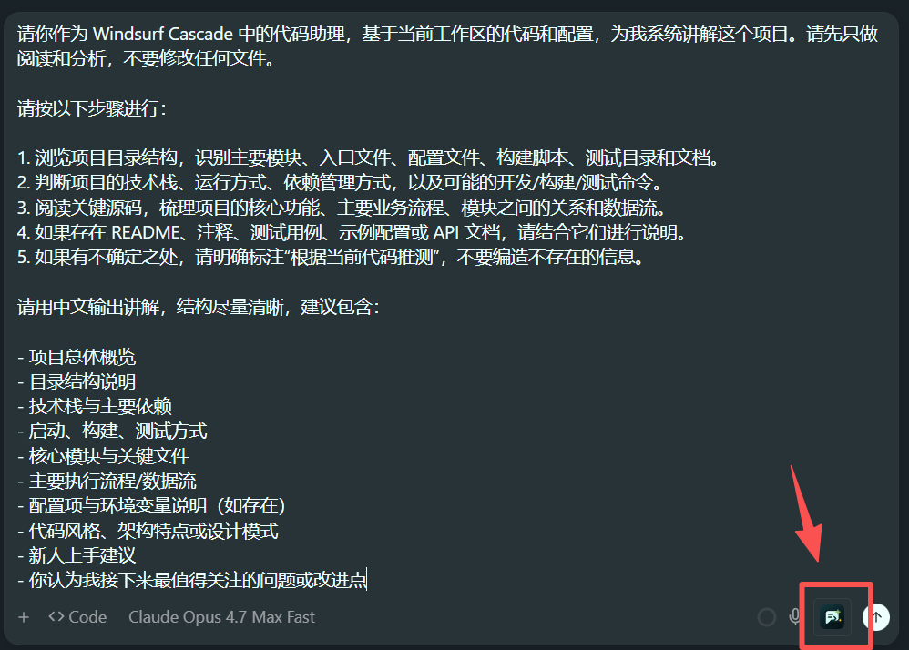

# openPE 客户端与接口参考

[返回 README](README.md) | [配置效果与案例](CONFIG.md) | [常见问题](FAQ.md) | [可复制配置模板](.env.example)

本文档说明 Codex、Claude Code、Devin、Windsurf 的 hook 安装方式，以及 HTTP、命令行和实验性 IDE patch 的详细用法。

第一次使用请先完成 [README 快速开始](README.md#快速开始)。

## 共同约定

### Hook 是什么

Hook 是客户端在发送消息前执行的一段命令。安装 openPE hook 后，在客户端输入：

```text
pe <你的需求>
```

客户端会调用 `openpe <client> hook run`。openPE 默认阻断原始消息，把增强结果复制到剪贴板并写入缓存。

### 配置文件

用户级 hook 默认读取：

```text
~/.config/openpe/.env
```

项目级 hook 默认读取项目目录中的 `.env`。

优先级：

```text
shell 环境变量 > OPENPE_ENV_FILE 指向的 dotenv > 当前目录 .env
```

### 安装器如何修改配置

安装器会读取现有 JSON、合并 openPE hook，再原子写回。已有的其它 hook 和配置不会被主动删除。

如果宿主在安装期间同时修改配置，openPE 会重新读取并合并；连续冲突三次后停止并返回错误。

使用 symlink 管理配置时，openPE 会写入链接目标，不会把链接替换成普通文件。

### 最近一次增强结果

```bash
openpe <client> hook last              # Markdown 预览
openpe <client> hook last --prompt     # 只输出增强提示词
openpe <client> hook last --path       # 显示预览文件路径
openpe <client> hook last --path --prompt
```

`<client>` 可用 `codex`、`claude`、`devin`、`windsurf`。

自定义 `OPENPE_CACHE_DIR` 表示缓存根目录。openPE 会在其下创建客户端子目录，避免不同客户端覆盖彼此的结果。

### 用户规范点名（pe+）

四个客户端的 hook 都支持在触发词后显式点名用户规范：

```text
pe+三问 帮我完成如下任务xxx
pe+三问+write-style 给 server 写部署说明
pe+commit-style:按逻辑分开提交
```

openPE 读取 `~/.config/openpe/specs/<名字>.md`（目录可用 `OPENPE_SPECS_DIR` 改），把文件内容逐字追加到增强结果后段，随剪贴板/注入一起交付；反馈中会注明"已应用规范"。规范不进入增强模型请求，不消耗增强 token。

点名的规范不存在、内容为空或超过上限时，本次增强被阻断并说明原因（未找到时会列出目录中现有的规范名），原始消息不会发送；改正后重发即可。语法、目录与上限的完整说明见 [CONFIG.md](CONFIG.md#用户规范pe-点名加载)。

## Codex CLI

已验证 Codex CLI `0.132.0`。

### 安装

```bash
# 用户级：~/.codex/hooks.json
openpe codex hook install

# 项目级：<项目>/.codex/hooks.json
openpe codex hook install --scope project

# 自定义 dotenv
openpe codex hook install --env-file /absolute/path/to/.env

# 自定义 hooks.json
openpe codex hook install --path /absolute/path/to/hooks.json

# 只打印合并结果，不写文件
openpe codex hook install --dry-run
```

### 安装选项

| 选项 | 默认值 | 说明 |
|---|---|---|
| `--scope` | `user` | `user` 或 `project` |
| `--path` | 根据 scope 推断 | 显式 hooks.json 路径 |
| `--env-file` | 用户级用 `~/.config/openpe/.env`；项目级用项目 `.env` | hook 读取的 dotenv |
| `--openpe-bin` | PATH 中的 `openpe` | 写入 hook 的可执行文件路径 |
| `--hook-timeout` | `120` | Codex hook 超时秒数 |

安装或修改后，在 Codex TUI 中执行 `/hooks`，检查并信任 openPE hook。未信任的 hook 不会执行。

触发演示（在 Codex TUI 中输入 `pe <prompt>` 后的反馈）：


### 会话历史

Codex 历史默认开启。openPE 用当前 `pe` 原文从 `~/.codex/history.jsonl` 查找 session，再读取对应 rollout 的最近 user/assistant 消息。

以下情况不会带入历史，并会在反馈中说明原因：

- 无法唯一定位 session；
- session 的工作目录与当前目录不一致；
- rollout 不存在或没有可用消息。

读取文件失败会显示明确错误，不会伪装成“已经带入历史”。

关闭历史：

```dotenv
OPENPE_CODEX_HISTORY_ENABLED=false
```

常用上限：

```dotenv
OPENPE_CODEX_HISTORY_MAX_MESSAGES=12
OPENPE_CODEX_HISTORY_MAX_CHARS=12000
```

### 注意事项

- Codex hook 的 `cwd` 来自当前 session，会影响工作目录相关的上下文。
- 用户级和项目级 hook 同时存在时，项目级 openPE hook 会检测用户级配置并跳过重复执行。
- Codex TUI 可能把反馈压成一行；完整结果用 `openpe codex hook last` 查看。
- Codex 的 `/` 菜单只显示内置命令。openPE 的正式入口是 `pe <内容>`，不是 `/pe`。

## Claude Code

已验证 Claude Code CLI `2.1.146`。

### 安装

```bash
# 用户级：~/.claude/settings.json
openpe claude hook install

# 自定义 dotenv
openpe claude hook install --env-file /absolute/path/to/.env

# 自定义 settings.json
openpe claude hook install --path /absolute/path/to/settings.json

# 只打印合并结果
openpe claude hook install --dry-run
```

### 安装选项

| 选项 | 默认值 | 说明 |
|---|---|---|
| `--path` | `~/.claude/settings.json` | Claude settings 路径 |
| `--env-file` | `~/.config/openpe/.env` | hook 读取的 dotenv |
| `--openpe-bin` | PATH 中的 `openpe` | 写入 hook 的可执行文件路径 |
| `--hook-timeout` | `120` | Claude hook 超时秒数 |

安装后重新启动 Claude Code。

触发演示（在 Claude Code 中输入 `pe <prompt>` 后的反馈）：


### 会话历史

Claude Code 会在 hook 输入中提供 `transcript_path`。openPE 从中读取最近的 user/assistant 文本消息。

以下情况不会带入历史，并会在反馈中说明：

- transcript 不存在或为空；
- transcript 中的工作目录与当前目录不一致；
- 没有可用的 user/assistant 消息。

关闭历史：

```dotenv
OPENPE_CLAUDE_TRANSCRIPT_ENABLED=false
```

常用上限：

```dotenv
OPENPE_CLAUDE_TRANSCRIPT_MAX_MESSAGES=12
OPENPE_CLAUDE_TRANSCRIPT_MAX_CHARS=12000
```

### 剪贴板失败

Claude Code 的 hook 子进程有时无法访问系统剪贴板。复制失败时，openPE 默认会把完整增强结果附在 blocked feedback 中，也可以运行：

```bash
openpe claude hook last --prompt
```

Claude Code `--print` 模式会执行 hook，但不一定稳定展示 blocked feedback。调试时建议使用交互式 TUI。

## Devin CLI

Devin CLI 使用与 Claude Code 兼容的 hook 结构。默认仍采用 review 模式；也支持 `additionalContext` 注入。

### 安装

```bash
# 用户级：~/.config/devin/config.json 的 hooks 字段
openpe devin hook install

# 项目级：<项目>/.devin/hooks.v1.json
openpe devin hook install --scope project

# 自定义 dotenv
openpe devin hook install --env-file /absolute/path/to/.env

# 自定义配置文件
openpe devin hook install --path /absolute/path/to/config.json

# 只打印合并结果
openpe devin hook install --dry-run
```

### 安装选项

| 选项 | 默认值 | 说明 |
|---|---|---|
| `--scope` | `user` | `user` 或 `project` |
| `--path` | 根据 scope 推断 | `config.json` 使用 `hooks` 字段，其它文件按独立 hooks 文件处理 |
| `--env-file` | 用户级用 `~/.config/openpe/.env`；项目级用项目 `.env` | hook 读取的 dotenv |
| `--openpe-bin` | PATH 中的 `openpe` | 写入 hook 的可执行文件路径 |
| `--hook-timeout` | `120` | Devin hook 超时秒数 |

安装后运行 `/hooks`，确认 openPE 已加载。修改配置后重新打开会话。

触发演示（在 Devin CLI 中输入 `pe <prompt>` 后的反馈）：


### 多 hook 去重

Devin 可能同时加载 Devin 格式和 Claude Code 格式的 hook，并且会依次执行全部 hook。

openPE 的处理方式：

- 第一个 openPE hook 完成增强；
- 其余 hook 不再调用模型；
- Review 模式下，后续 hook 重放同一增强结果和提醒；
- 注入模式下，后续 hook 静默跳过，避免重复注入。

Linux 上，去重会优先使用当前 Devin session 身份，避免并行会话互相复用结果。

### 超时保护

宿主到达 timeout 后会直接终止 hook。安装器会给 openPE 设置一个更早的自我截止时间：默认宿主 120 秒时，openPE 在 115 秒前收尾。

手动 `pe` 超时时，openPE 会阻断原始消息并明确说明没有提交。注入模式下，超时会放行普通消息，避免阻塞整个会话。

```dotenv
OPENPE_HOOK_DEADLINE=100s
```

该值必须为正数。安装命令还会根据 `--hook-timeout` 写入更短的实际 deadline。

### 会话历史

Devin 历史默认开启。

Linux 上，openPE 会沿进程关系定位当前 Devin session。识别成功时不受“最近活跃时间”限制，也能处理同一工作目录下的并行会话。

无法精确识别时，openPE 会回退到“工作目录 + 最近活跃”判断：

- 默认只使用最近 6 小时内的 session；
- 同一目录出现多个可能的 session 时不带入历史；
- 没有可靠结果时明确说明“本次未带前文上下文”。

```dotenv
OPENPE_DEVIN_HISTORY_ENABLED=true
OPENPE_DEVIN_HISTORY_RECENCY=6h
OPENPE_DEVIN_HISTORY_MAX_MESSAGES=12
OPENPE_DEVIN_HISTORY_MAX_CHARS=12000
```

Devin 压缩会话后，openPE 会把压缩摘要作为历史带入，并在反馈中说明。

更详细的历史问题见 [FAQ Q1-Q6](FAQ.md#一会话历史与时效窗口)。

## Windsurf

### 安装

```bash
# 用户级：~/.codeium/windsurf/hooks.json
openpe windsurf hook install

# 项目级：<项目>/.windsurf/hooks.json
openpe windsurf hook install --scope project

# 自定义 dotenv
openpe windsurf hook install --env-file /absolute/path/to/.env

# 只打印合并结果
openpe windsurf hook install --dry-run
```

### 安装选项

| 选项 | 默认值 | 说明 |
|---|---|---|
| `--scope` | `user` | `user` 或 `project` |
| `--path` | 根据 scope 推断 | 显式 hooks.json 路径 |
| `--env-file` | 用户级用 `~/.config/openpe/.env`；项目级用项目 `.env` | hook 读取的 dotenv |
| `--openpe-bin` | PATH 中的 `openpe` | 写入 hook 的可执行文件路径 |
| `--hook-timeout` | `120` | 用于派生 openPE 自我截止时间 |

安装后重新启动 Windsurf 或重新打开 workspace。

触发演示（在 Windsurf Cascade 中输入 `pe <prompt>` 后的反馈）：


### 限制

Windsurf 的公开 hook 协议可以阻断原始 prompt，但不能替换输入框内容，也不支持 `additionalContext` 注入。因此 openPE 在 Windsurf 中始终采用 review 模式。

Windsurf hook 子进程通常没有控制 TTY，OSC52 不能作为可靠的剪贴板方式。系统剪贴板工具不可用时，请读取：

```bash
openpe windsurf hook last --prompt
```

Windsurf hook 没有可靠的当前 chat 历史身份，因此不会把未绑定的本地 trajectory 发送给模型。

## 注入和 review 配置

全局注入：

```dotenv
OPENPE_HOOK_INJECT=true
```

客户端覆盖：

```dotenv
OPENPE_CODEX_INJECT=true
OPENPE_CLAUDE_INJECT=true
OPENPE_DEVIN_INJECT=true
```

优先级为：客户端配置 > 全局配置 > `false`。

Windsurf 不支持注入；设置对应变量不会改变行为。

## 剪贴板和缓存

openPE 按顺序尝试当前平台可用的剪贴板方式，包括 `pbcopy`、`clip.exe`、`wl-copy`、`xclip` 和 OSC52。

如果复制失败，反馈会明确提醒不要直接粘贴旧剪贴板内容。可以从缓存取回：

```bash
openpe <client> hook last --prompt
```

默认缓存示例：

```text
~/.cache/openpe/codex/last-prompt.txt
~/.cache/openpe/claude/last-prompt.txt
~/.cache/openpe/devin/last-prompt.txt
~/.cache/openpe/windsurf/last-prompt.txt
```

Windows、macOS 和 Linux 的实际根目录由平台决定；可用 `OPENPE_CACHE_DIR` 覆盖根目录。

## HTTP 和命令行接口

这些接口用于测试、自动化和 IDE 集成。日常交互建议使用 hook。

### HTTP server

安装：

```bash
go install ./cmd/openpe-server
```

启动：

```bash
openpe-server
openpe-server --listen 127.0.0.1:9000
```

server 只允许监听 `127.0.0.1`、`::1` 或 `localhost`。远程访问需要在外层使用 TLS 反向代理或隧道，回源到 loopback。

可用路由：

| 路由 | 说明 |
|---|---|
| `GET /healthz` | 健康检查，不要求 bearer token |
| `GET /v1/info` | 版本、认证、CORS 和 lifecycle 信息 |
| `POST /v1/prompt-enhance` | 提示词增强 |

最小请求：

```bash
curl http://127.0.0.1:18980/v1/prompt-enhance \
  -H 'content-type: application/json' \
  -d '{"prompt":"帮我实现这个接口","client":"codex","mode":"agent"}'
```

启用 bearer token：

```dotenv
OPENPE_SERVER_TOKEN=replace-with-a-64-character-lowercase-hex-token
```

设置后，`/v1/*` 请求需要：

```text
Authorization: Bearer <token>
```

`/healthz` 始终免鉴权。

HTTP 请求要求：

- 请求体不超过 2 MiB；
- 只接受一个 JSON object；
- 未知字段和尾随 JSON 会返回 400；
- provider 和内部错误返回稳定文案及 `request_id`；
- server 设置读取、写入、空闲连接和 handler timeout。

响应示例：

```json
{
  "enhanced_prompt": "请在当前仓库中实现该接口……",
  "warnings": [],
  "metadata": {
    "used_context": ["history"],
    "sections": [
      {"name": "original_prompt", "length": 20, "truncated": false}
    ],
    "provider": "openai-compatible",
    "model": "your-model"
  }
}
```

请求选项：

- `options.max_context_tokens`：本次输入上下文预算；
- `options.return_metadata`：显式 `false` 时省略 metadata。

### 裸 CLI

```bash
openpe enhance --prompt "帮我检查这个 Go 项目的测试失败"
openpe enhance --json --prompt "优化这个需求描述"
```

### Codex exec 包装

```bash
openpe codex --dry-run --prompt "整理这个任务"
openpe codex --prompt "整理这个任务" --codex-arg --yes
```

### 直接测试 hook stdin

```bash
printf '{"hook_event_name":"UserPromptSubmit","prompt":"pe fix this","cwd":"'"$PWD"'"}' \
  | openpe codex hook run

printf '{"agent_action_name":"pre_user_prompt","tool_info":{"user_prompt":"pe fix this"}}' \
  | openpe windsurf hook run
```

## 实验性 IDE patch

`extensions/openpe-windsurf-patch/` 提供实验性的 Electron bundle patch。它不是 native hook 的替代方案。

当前支持范围：

| Profile | 状态 |
|---|---|
| Devin Desktop | 仅指定 Windows exact build 支持独立多文件 patch 入口 |
| Legacy Windsurf | 只读识别；mutation 默认关闭 |
| 未知产品 | 拒绝修改 |

Exact Devin patch 会修改 Electron main、sessions、workbench、HTML CSP、sandbox preload 和 `product.json` 六个 artifact，并创建可验证的恢复 transaction。

正式使用仍建议：

```bash
openpe devin hook install
```

需要测试 Desktop 按钮时，请严格按子项目文档操作：

- [IDE patch README](extensions/openpe-windsurf-patch/README.md)
- [Inject payload README](extensions/openpe-windsurf-patch/inject/README.md)

按钮示意（legacy Windsurf Cascade 截图，注入成功后出现在 prompt 输入框右下角）：



不要把旧 build 的 transaction 恢复到新版本 IDE。安装、恢复和升级前都要完整退出 Devin、WindsurfGate 和 updater。

## 开发者参考

### 架构

```text
client / hook / HTTP
  -> adapter
  -> enhancer.Request
  -> context pipeline
  -> prompt rewrite core
  -> provider
  -> enhancer.Response
  -> clipboard / cache / injection
```

### 主要模块

| 路径 | 职责 |
|---|---|
| `cmd/openpe` | CLI、hook install/run、裸增强入口 |
| `cmd/openpe-server` | 本地 HTTP server |
| `internal/enhancer` | 核心请求、prompt assembly、语言守卫和内容提醒 |
| `internal/providers/openai` | OpenAI-compatible `/v1/chat/completions` |
| `internal/providers/anthropic` | Anthropic Messages `/v1/messages` |
| `internal/adapters/*` | 客户端输入、输出和交付差异 |
| `internal/context/*` | 可选上下文来源 |
| `internal/server` | HTTP、bearer、CORS、info 和 lifecycle |
| `internal/integration` | IDE installer 与 server 的本地握手契约 |

### Canonical 请求

核心增强逻辑接收：

- `prompt`
- `client`
- `mode`
- `cwd`
- `history`
- `rules` / `guidelines`
- `context.files` / `context.retrieval`
- `options.max_context_tokens`
- `options.return_metadata`

`client` 和 `mode` 只用于描述目标运行环境，不把客户端私有能力变成核心依赖。

增强结果应当：

- 保留用户意图、输入语言和显式约束；
- 输出可独立执行、可检查、可粘贴的任务描述；
- 不假设剪贴板、注入或输入框替换一定成功；
- 不突破用户声明的上下文预算；
- 通过 warnings 披露检测到的风险，不静默改变用户决策。

### 项目边界

- 不代理完整 agent 对话或 completion；
- 不保存长期会话状态；
- 不强制依赖 Openace；
- 不把实验性 IDE patch 当成默认集成方式；
- 不直接提供远程 HTTP 服务，server 只监听 loopback。

### 验证

```bash
go test ./...
go vet ./...
go build ./cmd/openpe ./cmd/openpe-server
```
