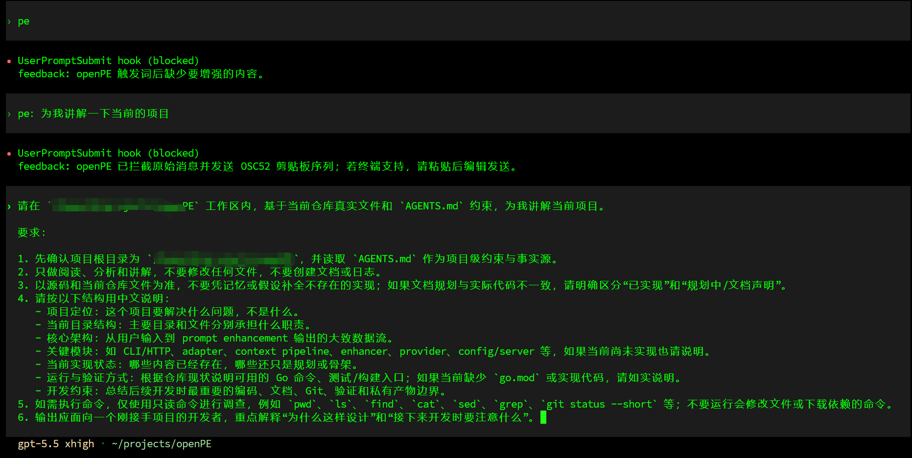

# openPE

English | [中文](README.md)

openPE is a local prompt enhancement tool for Codex CLI, Claude Code, Devin CLI, and Windsurf.

After installing a hook, type the following in your client:

```text
pe add tests for this API
```

Before the message is sent, openPE intercepts the original text, adds available conversation context, generates a clearer task description, and copies the result to your clipboard for review.

By default, the original `pe` message is not sent to the model. Codex, Claude Code, and Devin can also inject the enhanced prompt directly.

## Highlights

- **Keep your current tools**: continue using Codex, Claude Code, Devin, or Windsurf with an extra enhancement step before submission.
- **Use your own API**: requests go directly to the model endpoint you configure. openPE does not provide an intermediary model service.
- **Use recent context when available**: openPE reads recent client history when the client exposes a reliable source.
- **Review before sending**: the default mode blocks the original message and copies the enhanced prompt for you to inspect.
- **Show actionable warnings**: delivery feedback reports numbers that were not present in context, undecided irreversible actions, and unresolved language drift.

## Quick start

Go **1.25.12 or newer** is required.

### 1. Install

```bash
git clone https://github.com/AoManoh/openpe.git
cd openpe
go install ./cmd/openpe
```

The regular hook workflow only needs `openpe`. Install `openpe-server` only for HTTP automation or the experimental IDE button:

```bash
go install ./cmd/openpe-server
```

Verify the installation:

```bash
openpe -h
```

If your shell reports `openpe: command not found`, add the Go binary directory to `PATH` (use `~/.zshrc` instead when running zsh):

```bash
echo 'export PATH="$PATH:$(go env GOPATH)/bin"' >> ~/.bashrc
source ~/.bashrc
openpe -h
```

See [FAQ Q0](FAQ.md#q0-go-install-成功了但-openpe未找到命令) for the full diagnosis. The troubleshooting document is currently written in Chinese.

### 2. Configure a model API

openPE uses a plain-text `.env` configuration file. Each line contains one `NAME=value` setting, and lines beginning with `#` are comments. Hooks reload this file on every invocation. The recommended user-level location is:

```bash
mkdir -p ~/.config/openpe
```

#### OpenAI-compatible API (default)

```bash
cat > ~/.config/openpe/.env <<'EOF'
OPENPE_BASE_URL=https://your-openai-compatible-endpoint
OPENPE_API_KEY=replace-with-your-api-key
OPENPE_MODEL=your-model
OPENPE_LANGUAGE=en
EOF
```

This works with OpenAI, DashScope, Volcano Engine, and self-hosted gateways that expose `/v1/chat/completions`. `OPENPE_BASE_URL` has no built-in default; use your actual endpoint.

#### Anthropic Messages API

If your endpoint exposes `/v1/messages`, select the Anthropic protocol explicitly:

```bash
cat > ~/.config/openpe/.env <<'EOF'
OPENPE_PROVIDER=anthropic
OPENPE_BASE_URL=https://your-anthropic-compatible-endpoint
OPENPE_API_KEY=replace-with-your-api-key
OPENPE_MODEL=your-model
OPENPE_LANGUAGE=en
EOF
```

Without `OPENPE_PROVIDER=anthropic`, openPE uses the default OpenAI protocol and requests `/v1/chat/completions`, which usually returns HTTP 404 for an Anthropic-only endpoint. See [FAQ Q0.1](FAQ.md#q01-配置-anthropic-地址后为什么返回-openai-compatible-provider-http-404).

Test the configuration:

```bash
OPENPE_ENV_FILE="$HOME/.config/openpe/.env" \
openpe enhance --prompt "turn this request into a clear implementation task"
```

A returned enhanced prompt confirms that the protocol, endpoint, API key, and model name are valid.

### 3. Install a client hook

Install one or more of the clients you use:

```bash
openpe codex hook install
openpe claude hook install
openpe devin hook install
openpe windsurf hook install
```

After installation:

- Codex: run `/hooks` in the TUI, review the hook, and trust it.
- Claude Code: restart Claude Code.
- Devin: run `/hooks` and confirm that openPE is loaded.
- Windsurf: restart the IDE or reopen the workspace.

Project-level installation, custom paths, and client-specific limitations are documented in [CLIENTS.md](CLIENTS.md). The detailed client reference is currently written in Chinese.

### 4. Use openPE

Type any of the following in the client input box:

```text
pe convert this test to table-driven style
pe:convert this test to table-driven style
pe：convert this test to table-driven style
```

The default workflow is:

1. openPE blocks the original `pe` message;
2. the configured model generates an enhanced prompt;
3. openPE copies the result to the clipboard;
4. you paste, review, edit, and send it.

If clipboard delivery is unavailable, print the most recent result:

```bash
openpe <client> hook last --prompt
```

`<client>` can be `codex`, `claude`, `devin`, or `windsurf`.

After triggering, the client shows openPE's feedback. Codex example:



Trigger demos for the other clients are in [CLIENTS.md](CLIENTS.md).

## Delivery modes

### Review mode (default)

The original `pe` message is not sent to the model. The enhanced prompt is written to the clipboard and local cache for you to review.

This is the only hook delivery mode supported by Windsurf.

### Injection mode

Codex, Claude Code, and Devin can receive the enhanced prompt as additional context:

```dotenv
OPENPE_HOOK_INJECT=true
```

You can also enable injection for one client only:

```dotenv
OPENPE_CODEX_INJECT=true
OPENPE_CLAUDE_INJECT=true
OPENPE_DEVIN_INJECT=true
```

Injection skips manual review. For prompts involving numbers, deployments, deletion, releases, payments, or pushes, review mode is the safer default.

## Common configuration

Precedence: shell environment > the dotenv selected by `OPENPE_ENV_FILE` > `.env` in the current directory.

| Variable | Default | Purpose |
|---|---:|---|
| `OPENPE_PROVIDER` | `openai` | API protocol: `openai` or `anthropic` |
| `OPENPE_BASE_URL` | none | Model API endpoint; required |
| `OPENPE_API_KEY` | none | API key; required |
| `OPENPE_MODEL` | none | Model name; required |
| `OPENPE_TIMEOUT` | `60s` | Timeout for one model request |
| `OPENPE_LANGUAGE` | `zh` | Language of openPE status messages: `zh` or `en` |
| `OPENPE_MAX_TOKENS` | `0` | Output limit; Anthropic uses 4096 when set to 0 |
| `OPENPE_MAX_CONTEXT_TOKENS` | `0` | Input context budget; 0 disables the limit |
| `OPENPE_PROMPT_STYLE` | `agent` | Changes output detail: `agent` is concise; `human` expands goals, steps, and verification |
| `OPENPE_MESSAGE_STYLE` | `flatten` | Changes how history and references are sent: `hybrid` preserves dialogue roles; `structured` also separates reference material from the current task |
| `OPENPE_HOOK_INJECT` | `false` | Enable direct injection where supported |
| `OPENPE_CACHE_DIR` | platform default | Root directory for the latest per-client result |
| `OPENPE_WARNINGS_ENABLED` | `true` | Report out-of-context numbers and undecided actions |
| `OPENPE_LANGUAGE_GUARD_ENABLED` | `true` | Detect clear output-language drift |

### Choose settings by the result you want

| Result you want to change | Setting to review |
|---|---|
| An Anthropic endpoint returns 404 | `OPENPE_PROVIDER=anthropic` |
| Model output is truncated | `OPENPE_MAX_TOKENS` |
| Too much history increases input cost | `OPENPE_MAX_CONTEXT_TOKENS` or the client history limits |
| Enhanced prompts are too long or too brief | `OPENPE_PROMPT_STYLE` |
| “Continue the previous plan” loses the actual plan | Confirm history was included, then compare `OPENPE_MESSAGE_STYLE=hybrid` |
| Rules or file content become mistaken execution requirements | Compare `OPENPE_MESSAGE_STYLE=structured` |
| You do not want to paste manually | `OPENPE_HOOK_INJECT=true` |
| Language drift should not trigger an extra model call | `OPENPE_LANGUAGE_GUARD_REANCHOR=false` |

See [CONFIG.md](CONFIG.md) for before/after examples, expected effects, trade-offs, and verification steps. The full configuration guide is currently written in Chinese. Use [`.env.example`](.env.example) as a copy-ready template.

## Conversation history and warnings

openPE reads recent conversations according to what each client exposes:

- Codex: locates the session rollout using the current prompt and working directory.
- Claude Code: reads the `transcript_path` provided to the hook.
- Devin: identifies the current session directly on Linux when possible; otherwise uses conservative working-directory and recency checks.
- Windsurf: does not send local trajectory history because the hook protocol does not provide a reliable binding to the current chat.

The delivery message always states whether history was included. Enhancement can still succeed without history; it simply does not contain previous turns.

Warnings are displayed when the enhanced prompt contains:

- numbers that do not appear in the original input or context;
- push, deployment, deletion, release, or payment actions that you did not request;
- a clear language mismatch that the automatic retry did not correct.

Warnings do not rewrite or block the enhanced result.

## HTTP and direct CLI

The HTTP server is for testing, automation, and experimental IDE integration. Normal hook usage does not need a running server.

```bash
openpe-server
```

It only binds to `127.0.0.1`, `::1`, or `localhost`. For remote access, put a TLS reverse proxy or tunnel in front of the loopback server.

Minimal request:

```bash
curl http://127.0.0.1:18980/v1/prompt-enhance \
  -H 'content-type: application/json' \
  -d '{"prompt":"turn this into a clear implementation task","client":"codex","mode":"agent"}'
```

Direct CLI:

```bash
openpe enhance --prompt "analyze these failing Go tests"
openpe enhance --json --prompt "improve this requirement"
```

See [CLIENTS.md](CLIENTS.md#http-和命令行接口) for HTTP, CLI, and debugging details.

## Supported integrations

| Integration | Status | Capabilities |
|---|---|---|
| Codex CLI hook | Recommended | Review, injection, and conversation history |
| Claude Code hook | Recommended | Review, injection, and transcript history |
| Devin CLI hook | Recommended | Review, injection, deduplication, and conversation history |
| Windsurf hook | Recommended | Review only; hook injection is not supported |
| Devin Desktop bundle patch | Experimental | One exact Windows build only; not recommended as the default installation path |

See [CLIENTS.md](CLIENTS.md) for installation options, configuration locations, and client limitations.

## Troubleshooting

See [FAQ.md](FAQ.md) for:

- `go install` succeeded but `openpe` is not found;
- an Anthropic endpoint returns HTTP 404;
- why the client displays `Prompt blocked`;
- why conversation history was not included;
- how to recover the result when clipboard delivery fails;
- why Devin may invoke more than one hook for a single prompt;
- how to choose between `agent` and `human` prompt styles.

## How it works

```text
client input
  -> hook / CLI / HTTP
  -> client adapter
  -> prompt enhancement core
  -> OpenAI-compatible or Anthropic provider
  -> enhanced prompt
  -> clipboard / cache / injection
```

Project boundaries:

- openPE performs one rewrite before a prompt enters the client; it does not proxy complete agent conversations.
- openPE does not store long-term conversation state. It only caches the latest result for each client.
- Openace is a deprecated, disabled-by-default optional context source. Core enhancement does not depend on it.
- The IDE bundle patch is an independent experiment, not a replacement for the supported hook workflow.

Developer interfaces, module responsibilities, and the canonical enhancement contract are documented in [CLIENTS.md](CLIENTS.md#开发者参考).

## Documentation

| Document | Contents |
|---|---|
| [README.md](README.md) | Chinese README |
| [CLIENTS.md](CLIENTS.md) | Client integrations, HTTP, IDE patch, and developer reference (Chinese) |
| [CONFIG.md](CONFIG.md) | Configuration effects, use cases, trade-offs, and verification (Chinese) |
| [FAQ.md](FAQ.md) | Troubleshooting and behavior explanations (Chinese) |
| [.env.example](.env.example) | Copy-ready complete configuration template |
| [IDE patch README](extensions/openpe-windsurf-patch/README.md) | Experimental Desktop patch details (Chinese) |

## Development

```bash
go test ./...
go vet ./...
go build ./cmd/openpe ./cmd/openpe-server
```

Before submitting changes, verify the affected tests, builds, and documentation links.
