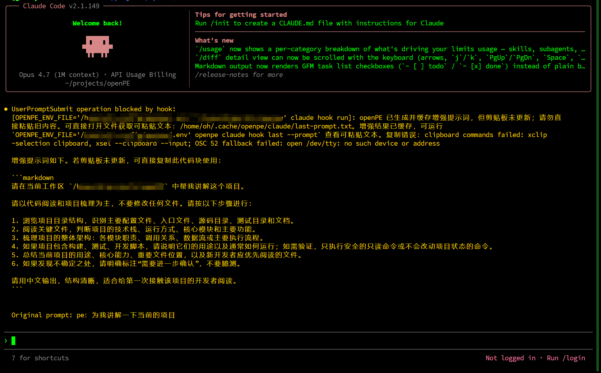
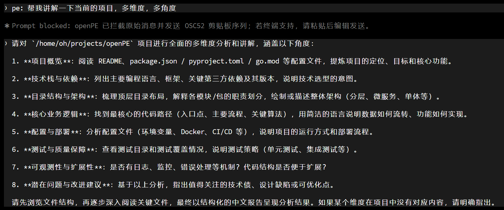
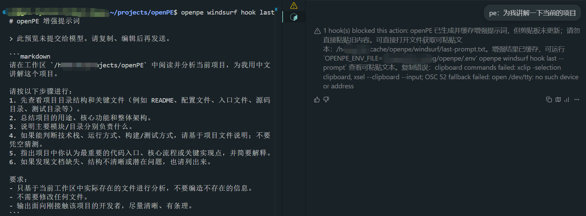

# openPE

`openPE`（open prompt-enhancer）是一个本地优先的 prompt 增强工具链。你在 Codex CLI、Claude Code、Devin CLI、Devin Local（原 Windsurf Cascade）中输入 `pe <你的需求>`，openPE 会先调用一次 OpenAI-compatible 模型把原文改写成更适合编码代理执行的 prompt，默认拦下原文、把增强结果复制到剪贴板，由你粘贴、按需编辑、再发送；支持注入的宿主（Devin / Codex / Claude）可用开关改为直接注入（详见 [Devin CLI hook](#devin-cli-hook)）。

- **本地优先**：数据流经你自配的 OpenAI-compatible endpoint（OpenAI、阿里云 DashScope、火山引擎、自建网关均可），不经第三方中转。
- **Hook-first**：通过宿主公开的 `UserPromptSubmit` / `pre_user_prompt` hook 协议接入，不替换、不代理、不劫持其它请求。
- **统一交付**：一条命令为 Codex / Claude Code /Devin（原 Windsurf）安装 hook，共用同一个 enhancer 和缓存模型。

## 为什么需要它

- 你写的原始 prompt 经常缺少上下文、约束或验证期望，导致 coding agent 走偏。
- 你已经在用 Codex / Claude Code / Devin（原 Windsurf），不想换主力工具，只想给输入加一层"自动改写"。
- 你想自己决定改写质量与成本，不被任何厂商的私有 prompt 绑死。

## 快速开始

需要 **Go 1.25.12 或更高版本**。`go.mod` 的最低版本就是 1.25.12；`GOTOOLCHAIN=auto` 可自动下载安全工具链，`GOTOOLCHAIN=local` 使用 1.25.9 等旧版时会在构建前明确拒绝。

### 1. 构建并安装 binary

```bash
# 推荐：克隆后本地构建
git clone https://github.com/AoManoh/openpe.git
cd openpe
go install ./cmd/openpe            # 主程序：日常只需要它
go install ./cmd/openpe-server     # 可选：长驻 HTTP 服务，仅自动化 / IDE patch 集成才需要
```

> **两个 binary 的定位**：`openpe` 是你唯一需要的主程序——它既是裸 CLI（`openpe enhance ...`），也是安装到 Codex / Claude Code / Devin / Windsurf 后被各自 hook 调用的处理器（`openpe <client> hook run`）。`openpe-server` 是一个**可选的常驻 HTTP 服务**，把同一套增强能力暴露为 `POST /v1/prompt-enhance`，只在你要接入自动化脚本、其它进程，或已验证的实验性 IDE patch 按钮时才需要；**日常 hook 流程不需要它**，可以跳过第二条命令。

`go install` 把 binary 写到 `$GOBIN`（未设置时为 `$GOPATH/bin`，通常 `~/go/bin`）——**不是** Go 工具链所在的 `/usr/local/go/bin`。验证：

```bash
openpe -h
```

若提示 `openpe：未找到命令`（command not found），是该目录不在 `PATH`（新机器首装常见），加入后重试（zsh 用户改 `~/.zshrc`）：

```bash
echo 'export PATH="$PATH:$(go env GOPATH)/bin"' >> ~/.bashrc
source ~/.bashrc
openpe -h
```

排查细节见 [FAQ Q0](FAQ.md#q0-go-install-成功了但-openpe未找到命令)。

### 2. 配置 OpenAI-compatible endpoint

**只需 3 个必填变量即可启动**。推荐放在 `~/.config/openpe/.env`（hook 默认从这里加载）：

```bash
mkdir -p ~/.config/openpe
cat > ~/.config/openpe/.env <<'EOF'
# 必填 1：OpenAI-compatible 网关 base URL（无默认值，必须显式填写）
OPENPE_BASE_URL=https://api.openai.com
# 必填 2：对应网关的 API key
OPENPE_API_KEY=replace-with-your-api-key
# 必填 3：模型名，如 gpt-5.4-mini / qwen3.7-max / deepseek-v4-pro
OPENPE_MODEL=gpt-5.4-mini
EOF
```

其他字段（语言、超时、缓存路径、Openace、server token 等）都有合理默认，**不填也能跑**；完整可选项见 [服务配置 · 环境变量](#环境变量) 或 [`.env.example`](.env.example)。

> `OPENPE_BASE_URL` 请明确填你实际使用的网关地址——openPE **没有**内置默认 OpenAI 官方 URL，例中的 `https://api.openai.com` 只是占位例。支持阿里云 DashScope、火山引擎、自建网关等任意 OpenAI-compatible 地址；带或不带 `/v1` 结尾都可以。

验证 endpoint 连通：

```bash
OPENPE_ENV_FILE="$HOME/.config/openpe/.env" \
openpe enhance --prompt "帮我重构这个 handler"
```

PowerShell 使用：

```powershell
$env:OPENPE_ENV_FILE = "$HOME\.config\openpe\.env"
openpe enhance --prompt "帮我重构这个 handler"
```

正常返回增强 prompt 即说明 endpoint / key / model 三项可用。

### 3. 给目标客户端安装 hook（任选一个或全装）

```bash
openpe codex hook install      # → ~/.codex/hooks.json
openpe claude hook install     # → ~/.claude/settings.json
openpe devin hook install      # → ~/.config/devin/config.json
openpe windsurf hook install   # → ~/.codeium/windsurf/hooks.json
```

> Codex 装完还需要在 TUI 内执行 `/hooks` 并 trust；Devin CLI 可用 `/hooks` 确认已加载；Windsurf 装完建议重启 IDE。详见 [客户端配置参考](#客户端配置参考)。

### 4. 在客户端对话框输入 `pe <你的需求>`

触发关键字接受 3 种格式（任选其一）：

```text
pe 帮我把这个 Go 测试改成 table-driven
pe:帮我把这个 Go 测试改成 table-driven
pe：帮我把这个 Go 测试改成 table-driven
```

`pe:` / `pe：` 半角/全角冒号都识别，方便中文输入法下不切换标点。

实际触发演示（一行原始 prompt → 增强后的可粘贴版本）：

```text
[你输入]   pe 帮我把这个 Go 测试改成 table-driven
[stderr]   ✅ 已生成并复制增强提示词到剪贴板，请粘贴使用
           (cached: ~/.cache/openpe/<client>/last-prompt.txt)
[Ctrl+V]   请将以下 Go 测试改写为 table-driven 风格：
           - 保留原有断言语义；
           - 覆盖现有所有边界条件，新增 cases 至少涵盖
             nil / 空 / 正常 / error 4 类输入；
           - 验证：go test -v -run <TestName> ./path/to/pkg
```

openPE 会阻断这条原始消息（**不会**发给 LLM），把增强结果复制到系统剪贴板，并给出短状态。

**直接 Ctrl+V 粘贴到原输入框，按需编辑，再发送即可。**

> 「阻断 + 剪贴板」是所有客户端（含 Devin）的默认流程。想跳过粘贴、让代理直接按增强版执行：在支持注入的宿主（Devin / Codex / Claude）设 `OPENPE_HOOK_INJECT=true` 或按客户端设 `OPENPE_<CLIENT>_INJECT=true`。

> 若 stderr 显示"剪贴板未更新"——见 [注意事项与已知限制](#注意事项与已知限制)。

Hook 安装器对现有 JSON 做锁内 read→merge→guarded atomic replace：多个 openPE 安装并发会串行；若宿主/编辑器不遵守 sidecar lock 而在 merge 期间写入，installer 会检测后重新 merge（最多 3 次）而不是静默覆盖。dotfiles symlink 写真实 target 并保留链接；dangling symlink 也按目标路径互斥。

## 服务配置

openPE 不需要常驻服务进程：hook 在每次 `pe` 调用时按需启动子进程，完成后退出。HTTP server (`openpe-server`) 只在自动化集成场景下需要，见 [HTTP 与裸 CLI 调试入口](#http-与裸-cli-调试入口)。

### 环境变量

所有运行参数都通过环境变量传入。优先级：**shell 环境变量 > dotenv 文件**。dotenv 文件按以下顺序解析：

1. `OPENPE_ENV_FILE` 指向的文件（hook 安装时自动注入，见各客户端段）。
2. 当前工作目录下的 `.env`（裸 CLI 和 server 启动时读取）。

按“是否必填”分为 3 类。**只要填必填那 3 个就能启动**；其它都是可选。

#### 必填（3 个）

| 变量                | 说明                                                                                                                               |
| ------------------- | ---------------------------------------------------------------------------------------------------------------------------------- |
| `OPENPE_BASE_URL` | OpenAI-compatible 网关 base URL。**无默认值，必须显式填写**；带或不带 `/v1` 均可。改成阿里云 / 火山引擎 / 自建网关都可以。 |
| `OPENPE_API_KEY`  | 对应 base URL 的 API key。                                                                                                         |
| `OPENPE_MODEL`    | 模型名，如 `gpt-5.4-mini` / `qwen-max` / `deepseek-chat` / `gpt-5.5` 。                                                    |

#### 可选（有默认值，按需覆盖）

| 变量                                                     | 默认                         | 说明                                                                                                                                                                                                    |
| -------------------------------------------------------- | ---------------------------- | ------------------------------------------------------------------------------------------------------------------------------------------------------------------------------------------------------- |
| `OPENPE_LANGUAGE`                                      | `zh`                       | hook 终端反馈语言：`zh` / `en`                                                                                                                                                                      |
| `OPENPE_TIMEOUT`                                       | `60s`                      | 单次 provider 调用超时（Go duration）                                                                                                                                                                   |
| `OPENPE_HOOK_DEADLINE`                                 | `100s`                     | Devin 聚合 hook 的正数自我截止时间（Go duration，非正/非法值回退默认，安全上不允许关闭）。宿主 timeout 会直接杀 hook 且不读输出；安装器还按 `--hook-timeout` 派生更短的 CLI deadline。手动 `pe` 超时以“原文未提交”拦截，注入/auto 退化为放行 |
| `OPENPE_LISTEN_ADDR`                                   | `127.0.0.1:18980`          | `openpe-server` 监听地址，**仅允许 loopback**（`127.0.0.1` / `::1` / `localhost`）；`0.0.0.0`、`::`、LAN IP 等非 loopback 地址一律启动即拒绝——openPE 是本地优先工具，远程访问从来不是已确认的业务需求（2026-08-10 复核收窄），确有远程自动化需求请在外层用 TLS 反向代理/隧道。启用 lifecycle/descriptor 时 `OPENPE_SERVER_TOKEN` 必须是 64 位小写十六进制（256 bit） |
| `OPENPE_CACHE_DIR`                                     | `~/.cache/openpe`（Linux） | hook 预览与纯文本**缓存根目录**；始终在其下追加客户端命名空间（如 `<root>/devin/last-prompt.txt`、`<root>/codex/last-prompt.txt`），避免多客户端互相覆盖 `hook last`。旧版把 override 当最终目录；升级后如需保留旧缓存，请手动移动到对应客户端子目录 |                                                                                                                                                                             |
| `OPENPE_COPY_COMMAND`                                  | 自动探测                     | 覆盖剪贴板命令；接收 stdin（如 `xclip -selection clipboard`）。原生 Windows 用 `cmd.exe /C` 执行，POSIX/WSL 用 `sh -c` 执行；命令首段为 `clip.exe` 时会自动转为 UTF-16LE，避免 Windows 中文乱码 |
| `OPENPE_DISABLE_OSC52_CLIPBOARD`                       | `false`                    | 禁用 OSC52 剪贴板兜底                                                                                                                                                                                   |
| `OPENPE_OSC52_TTY`                                     | `/dev/tty`                 | OSC52 写入目标 TTY 路径                                                                                                                                                                                 |
| `OPENPE_CLAUDE_PROMPT_FALLBACK`                        | `true`                     | Claude 剪贴板失败时，在 blocked feedback 中输出完整增强 prompt 供复制                                                                                                                                   |
| `OPENPE_WINDSURF_PROMPT_FALLBACK`                      | `false`                    | Windsurf 剪贴板失败时是否输出完整增强 prompt；默认关闭以避免 IDE feedback 过长                                                                                                                          |
| `OPENPE_ENV_FILE`                                      | hook 安装时注入              | hook 子进程加载的 dotenv 文件路径                                                                                                                                                                       |
| `OPENPE_PROMPT_STYLE` | `agent` | 选择内置提示词风格，语义是"**增强结果写给谁**"：`agent`（默认）= 面向下游编码 agent 的最小忠实展开（v7i，金标准评测下对 agent 执行效果更优）；`human` = 面向**人阅读**的详尽报告体展开（v2，2026-07：保留 v7h 的目标/步骤/验证脚手架与详尽体量，修掉其被金标准确认的臆造缺陷——未提及的架构词汇、编造样例名、仪式步骤降至 agent 风格同水平；适合把增强结果当"如何系统展开需求"的范文来读/学习的用户）。两种风格护栏相同（用户视角/数值保真/决策保真等），差别只在详略与结构。非法取值会在启动时**响亮报错**并列出合法值，不会静默回退。显式设置 `OPENPE_SYSTEM_PROMPT[_FILE]` 时本参数被覆盖。详见 FAQ Q13 |
| `OPENPE_SYSTEM_PROMPT_FILE` / `OPENPE_SYSTEM_PROMPT` | 内置默认提示词（v7i）        | 覆盖增强器系统提示词（优先级最高，设置后 `OPENPE_PROMPT_STYLE` 失效）：`_FILE` 读取文件内容（优先），`OPENPE_SYSTEM_PROMPT` 为内联值；留空使用内置默认。内置默认当前为 **v7i**（2026-07）：在按输入分桶、防臆造非代码测试目标的基础上，含四条护栏并在提示词末尾 FINAL CHECK 复检——①**用户视角**：增强结果必须是"用户对 agent 的指令"，不吸收历史中助手的反问/自称；②**数值保真**：数字与组成只能逐字取自上下文中同一实体，总数不得分解成编造的分项；③**问题保持与决策保真**：用户输入是征询意见的问题时，增强结果必须仍是咨询请求（可枚举候选方向），不得替用户选择，更不得把上下文里的状态陈述（如"尚未 push"）翻转成执行指令；④**范围与篇幅纪律**：明确的单目标任务做"最小忠实展开"，不得膨胀成报告体项目计划（分节脚手架/未提及的架构词汇/通用仪式步骤）。用于自定义改写风格或部署自调版本，无需改代码重新编译 |
| `OPENPE_MAX_CONTEXT_TOKENS`                            | `0`（不限）                | 全局输入 token 硬预算，hook 与 HTTP/server 默认路径共享；按约 4 字符/token 计算，system、required task、history、rules/guidelines/files/retrieval 共用**同一份**预算，hybrid/structured 不再让每个 zone 各拿整份。可选上下文先裁剪；若 system+required task 本身已超预算则 400/validation error，绝不假称满足上限。`0` 明确禁用预算 |
| `OPENPE_MESSAGE_STYLE`                                | `flatten`                  | 消息构建结构：`flatten`（默认，`[system, user]`，历史以 `[role] content` 文本嵌入单条 user）；`hybrid`（`[system, 历史真多轮, 末轮 user 仅含改写指令+原 prompt]`，角色保真/指代更强，系统提示附加「前文仅供参考、勿作答」框架）；`structured`（在 hybrid 之上把 rules/guidelines/files/retrieval 从任务与对话流里分离为独立「只读参考块」置于历史之前，系统提示用三区框架标注参考块/历史/任务）。`hybrid`、`structured` 均为实验性，eval A/B 通过前默认仍为 `flatten` |
| `OPENPE_WARNINGS_ENABLED`（+ `OPENPE_WARNINGS_ACTIONS` / `OPENPE_WARNINGS_NUM_MAXLEN`） | `true` | **输出侧确定性告警**（提示词护栏之外与模型无关的兜底，2026-07 三起增强质量事故的结构性防线）：增强返回前做纯本地词法检测，命中只**追加提醒、绝不改写/拦截**。①上下文外数字——输出中的数字串未出现在你的输入/历史/规则/检索中则提醒"请核对是否臆造"（列表编号、标识符内数字、超长 id 自动豁免）；②未决策不可逆动作——输出含 push/部署/删除/发布/支付等动作而你的**原始输入**未提及（历史提及不豁免——事故 #3 的编造源正是历史状态行）则提醒"若非你的决策请删除"。告警随**全部四个正式 hook**（Codex / Claude / Windsurf / Devin）的披露显示（review 的 blocked 行 / 注入的 systemMessage），也随 HTTP `warnings` 字段返回；2026-08-10 修复前 Codex/Claude/Windsurf 不透传、Devin 的剪贴板状态会覆盖告警。`_ACTIONS` 逗号分隔追加动作词；`_NUM_MAXLEN` 数字长度上限（默认 5，超过视为 id/哈希） |
| `OPENPE_LANGUAGE_GUARD_ENABLED`                       | `true`                     | 语言守卫总开关：增强返回前做后处理，检测**用户输入语言**与**增强输出语言**（CJK/拉丁启发式，检测开销 <1ms）；仅当两侧都存在**明显主导文字系统**（主导文字权重须 ≥ 其它文字合计的 2 倍，CJK 每字按 2 个拉丁字母计权）且**不一致**时才动作。混合文本（如英文句子夹少量中文词、中文句子夹长英文标识符）判为 unknown 并 fail-open 不动作——2026-08-10 修复前，英文主体中出现 2 个汉字就会被误判为中文并触发多余的付费重请求。一致或 unknown 均为零成本空操作。设 `false` 完全关闭 |
| `OPENPE_LANGUAGE_GUARD_REANCHOR`                      | `true`                     | 检测到语言不一致时的策略：`true` = 追加强语言指令后**重请求一次**（strategy 1，命中不一致时多一次模型调用），修正失败则保留原输出并附 `Warnings` 提示；`false` = 只检测并告警、不重试（strategy 2，零额外延迟）。触发场景（如英文输入被模型改写成中文）本身低频，故对整体延迟影响很小 |
| `OPENPE_PROVIDER`                                     | `openai`                   | 模型 provider 协议：`openai`（默认，OpenAI 兼容 `/v1/chat/completions`）或 `anthropic`（Anthropic Messages API `/v1/messages`，用 `x-api-key` + `anthropic-version` 头）。用于只提供 Anthropic 格式的端点；未设/未知 → `openai`，现有配置不受影响 |
| `OPENPE_MAX_TOKENS`                                   | `0`（provider 默认）       | 模型响应最大 token 数。Anthropic 必填（`0` 时回退其默认 4096）；OpenAI 忽略（交给网关默认）。与 `OPENPE_MAX_CONTEXT_TOKENS`（输入侧预算）不同，这是**输出**长度上限 |
| `OPENPE_HOOK_INJECT`（+ `OPENPE_CODEX_INJECT` / `OPENPE_CLAUDE_INJECT` / `OPENPE_DEVIN_INJECT`） | `false` | 统一注入开关：默认 `false` = 拦截 + 剪贴板 review（保留「绝不自动应用、由你粘贴」哲学）；`true` = 把增强版作为 `additionalContext` 注入，代理直接按增强版执行。全局 `OPENPE_HOOK_INJECT` + 每客户端覆盖（每客户端优先 → 全局 → `false`）。已验证 Codex CLI / Claude Code(CLI) / Devin 均消费 `additionalContext`；**Windsurf 不支持**（开关无效空操作）；Claude 的 VSCode 扩展不消费（仅 CLI 生效）。配置经 dotenv 解析（hook 的 `--env-file` 可配） |
| `OPENPE_HOOK_DEDUP_ENABLED`                            | `true`                     | 跨适配器去重总开关，仅在 Devin 下生效：Devin 会把已加载的 openPE hook（devin/claude 格式）都跑一遍，开启后同一条 `pe` 只增强一次、各 hook 输出一致（详见 [Devin CLI hook](#devin-cli-hook)）；设 `false` 关闭 |
| `OPENPE_HOOK_DEDUP_WINDOW`                             | `5s`                       | 去重时间窗（Go duration）：判定「同一条 prompt（同一会话内）的重复触发」的新鲜度窗口。窗口内重复触发：增强成功则重放 claim 内绑定的增强结果；provider error/deadline 等无 preview 的失败也重放原 block reason；winner 尚未结论/异常退出时，手动 `pe` 仍 fail closed，绝不返回 `continue:true`。注入成功才 skip。claim 以原子文件保存，10 分钟 TTL、最多 2048 文件/16 MiB，避免敏感 prompt 永久归档 |

> **关于 `OPENPE_MAX_CONTEXT_TOKENS`**：这是 openPE 的“消费层”token 总预算旋钮。一处 server 配置同时覆盖 hook、裸 CLI 与未显式传 `options.max_context_tokens` 的 HTTP/experimental button 请求；请求显式正整数时覆盖 server 默认。各采集层的 `OPENPE_*_MAX_MESSAGES` / `_MAX_CHARS` 只决定**读多少**，消费层决定**最终送多少**。预算覆盖 system + required task + history + reference 全部消息；required floor 放不下时返回错误而不是突破上限。默认 0 = 不启用预算。

#### 按需启用（高级 / 实验性 / 有前置依赖）

<details>
<summary><b>Codex / Claude / Devin 对话 session 读取（<u>默认已启用</u>）</b></summary>

openPE 默认读取当前 Codex / Claude Code / Devin 对话上下文，启用满血提示词增强。**非静默**：未找到 session、`cwd` 不一致、超出时效窗口或读取失败时，都会在 hook 反馈里显式提示「本次未带前文上下文（原因）」或「读取历史上下文失败」，绝不静默兜底成无历史增强。仅在需要显式关闭时才需配置下面变量。

| 变量                                      | 默认                           | 说明                                                                                |
| ----------------------------------------- | ------------------------------ | ----------------------------------------------------------------------------------- |
| `OPENPE_CODEX_HISTORY_ENABLED`          | `true`                       | 是否读取本机 Codex session 历史并注入 `Request.History`；设为 `false` 关闭      |
| `OPENPE_CODEX_HOME`                     | `CODEX_HOME` 或 `~/.codex` | Codex 本地数据目录                                                                  |
| `OPENPE_CODEX_HISTORY_MAX_MESSAGES`     | `12`                         | Codex session history 注入的最近消息数上限                                          |
| `OPENPE_CODEX_HISTORY_MAX_CHARS`        | `12000`                      | Codex session history 注入的字符预算上限                                            |
| `OPENPE_CLAUDE_TRANSCRIPT_ENABLED`      | `true`                       | 是否读取 Claude `transcript_path` 并注入 `Request.History`；设为 `false` 关闭 |
| `OPENPE_CLAUDE_TRANSCRIPT_MAX_MESSAGES` | `12`                         | Claude transcript 注入的最近消息数上限                                              |
| `OPENPE_CLAUDE_TRANSCRIPT_MAX_CHARS`    | `12000`                      | Claude transcript 注入的字符预算上限                                                |
| `OPENPE_DEVIN_HISTORY_ENABLED`          | `true`                       | 在 Devin 下运行时，是否只读 Devin SQLite 会话库并注入 `Request.History`；设为 `false` 关闭 |
| `OPENPE_DEVIN_HISTORY_DB_PATH`          | 平台默认                       | Devin `sessions.db` 路径（默认 `~/.local/share/devin/cli/sessions.db`，Windows 为 `%APPDATA%\devin\cli\sessions.db`） |
| `OPENPE_DEVIN_HISTORY_MAX_MESSAGES`     | `12`                         | Devin session history 注入的最近消息数上限                                          |
| `OPENPE_DEVIN_HISTORY_MAX_CHARS`        | `12000`                      | Devin session history 注入的字符预算上限                                            |
| `OPENPE_DEVIN_HISTORY_RECENCY`          | `6h`                         | 定位到的 Devin session 最近活跃须在此时效窗口内才复用，避免注入同目录旧 session 的陈旧历史（2026-07 由 `2h` 上调，覆盖同日恢复场景） |

</details>

<details>
<summary><b>Openace 代码检索上下文（默认关闭，有前置依赖）</b></summary>

详见 [Openace 代码检索上下文](#openace-代码检索上下文)（含前置依赖说明）。

| 变量                                   | 默认               | 说明                                                        |
| -------------------------------------- | ------------------ | ----------------------------------------------------------- |
| `OPENPE_OPENACE_ENABLED`             | `false`          | 是否启用 Openace 代码检索上下文（启用前须确认 daemon 在跑） |
| `OPENPE_OPENACE_ADDR`                | `127.0.0.1:8765` | Openace daemon 地址；也可沿用 `OPENACE_DAEMON_ADDR`       |
| `OPENPE_OPENACE_TOKEN`               | 空                 | Openace daemon token；也可沿用 `OPENACE_DAEMON_TOKEN`     |
| `OPENPE_OPENACE_PROVIDER_PROFILE_ID` | 空                 | 可选 ACE provider profile                                   |
| `OPENPE_OPENACE_MAX_OUTPUT_LENGTH`   | `12000`          | 单次 Openace 检索结果上限                                   |
| `OPENPE_OPENACE_TIMEOUT`             | `30s`            | 单次 Openace daemon HTTP 调用超时                           |
| `OPENPE_OPENACE_MAX_RETRIES`         | `2`              | 临时错误最大重试次数，实际总尝试次数为 `1 + max_retries`  |
| `OPENPE_OPENACE_RETRY_BASE_DELAY`    | `250ms`          | Openace 重试指数退避起始延迟                                |
| `OPENPE_OPENACE_RETRY_MAX_DELAY`     | `2s`             | Openace 单次重试最大等待                                    |
| `OPENPE_OPENACE_RETRY_JITTER`        | `100ms`          | Openace 重试抖动上限                                        |

</details>

<details>
<summary><b>openpe-server 高级选项（bearer auth / CORS / lifecycle）</b></summary>

仅 [HTTP 与裸 CLI 调试入口](#http-与裸-cli-调试入口) 和 [IDE bundle patch](#ide-bundle-patch实验性) 需要。

| 变量                                | 默认                             | 说明                                                                              |
| ----------------------------------- | -------------------------------- | --------------------------------------------------------------------------------- |
| `OPENPE_SERVER_TOKEN`             | 空                               | HTTP bearer token（server 本身只监听 loopback）。lifecycle 模式要求 64 位小写十六进制；可用 `openssl rand -hex 32` 生成。lifecycle 关闭时仍兼容既有非空 token |
| `OPENPE_SERVER_CORS_ORIGINS`      | 空                               | CORS Origin allowlist，逗号分隔；空值禁用 CORS                                    |
| `OPENPE_SERVER_LIFECYCLE_ENABLED` | `false`                        | 是否在**成功 bind 后**写 descriptor。descriptor 以原子写发布；POSIX 为 0600，Windows 为受保护且仅当前用户的 DACL；发布与 ownership cleanup 共享跨进程锁 |
| `OPENPE_SERVER_DESCRIPTOR_FILE`   | `~/.config/openpe/server.json` | lifecycle descriptor 路径覆盖                                                     |

</details>

完整可选字段参考 [`.env.example`](.env.example)；必填只有 3 个，不要被表中的字段数量吓到。

### Openace 代码检索上下文（已废弃，默认关闭）

> **⚠️ 已废弃，不建议启用。** Openace 依赖 Augment Code 的 ACE 能力，而 Augment 已取消对用户友好的 $20 订阅层级——仅为提示词增强而启用 ACE 的代价过高，性价比不再成立。代码保留向后兼容（`OPENPE_OPENACE_ENABLED` 默认 `false`），但默认关闭且不再积极维护；新部署请勿依赖它。下文仅作历史参考。

[Openace](https://github.com/AoManoh/openace-mcp) 是**可选** context provider，**不是 openPE 的必选依赖**——未启用时 openPE 走完整的 prompt rewrite 流程，只是 `context.retrieval` 为空。引入它的目的是：让 prompt enhancement 阶段能在用户允许的范围内基于代码事实做更准确的改写——包括项目设计理念、技术决策、历史上下文、ADR/决策文章和关键调用链等——而不是把 openPE 的核心能力绑定到 Openace。

#### 前置依赖（启用前请确认 3 项缺一不可）

1. **本机已安装并运行 `openace-mcp` daemon**（默认监听 `127.0.0.1:8765`）。项目主页：https://github.com/AoManoh/openace-mcp。
2. **至少有一个 AI 客户端已接入该 MCP 服务**（Claude Code / Codex / Windsurf 等）。这是为了确保 Openace 已为当前代码域建索引，否则 openPE 发起检索返回为空。
3. **确认 8765 端口可联** ： `ss -tlnp | grep ':8765 '` 或 `curl -s http://127.0.0.1:8765/healthz`（如 daemon 提供）。不可联时不要启用，openPE 会返回明确错误而不静默降级。

三项都满足后，才设置 `OPENPE_OPENACE_ENABLED=true` 启用。

#### 启用例

```bash
OPENPE_OPENACE_ENABLED=true
OPENPE_OPENACE_ADDR=127.0.0.1:8765
openpe enhance --prompt "帮我修复 provider 超时重试" --cwd /path/to/repo
```

启用后，openPE 会在调用 prompt rewrite 模型前，基于 `prompt`、目标客户端、模式和 `cwd` 向本机 Openace daemon `POST /v1/retrieve` 发起一次代码检索，并把返回内容写入 canonical request 的 `context.retrieval`。如果调用方已经显式传入 `context.retrieval`，openPE 不会重复检索。

#### 启用范围（一处开关覆盖四条路径）

`OPENPE_OPENACE_ENABLED=true` 是**一处全局开关**，所有走 openPE `enhancer.Service` 的入口都会尝试使用同一套 Openace provider，无需各路径单独配置；实际发起代码检索还要求本次请求带有非空 `Request.CWD`：

| 入口                           | 触发方式                                 | 启用条件                                                                                                                                               |
| ------------------------------ | ---------------------------------------- | ------------------------------------------------------------------------------------------------------------------------------------------------------ |
| 裸 CLI                         | `openpe enhance --prompt ...`          | 当前 shell 环境 `OPENPE_OPENACE_ENABLED=true`                                                                                                        |
| Codex / Claude / Windsurf hook | IDE 对话框输入 `pe <内容>`             | hook dotenv（默认 `~/.config/openpe/.env`）含 `OPENPE_OPENACE_ENABLED=true`                                                                        |
| HTTP API                       | 任何外部进程 `POST /v1/prompt-enhance` | `openpe-server` 启动时所在 shell 含 `OPENPE_OPENACE_ENABLED=true`                                                                                  |
| Exact-build Devin patch 按钮 | 输入框旁 openPE logo | 共享 `openpe-server`；当前请求固定 `history=none` 且未传 workspace `cwd`，Openace 会跳过 |

Openace provider 由处理请求的进程在启动或构造 service 时注入：CLI / hook 子进程读取自己的环境变量，HTTP 与 patch 按钮读取 `openpe-server` 启动时的环境变量。换言之：**只要负责处理某次请求的进程（CLI 子进程 / hook 子进程 / openpe-server 主进程）在自己的环境里看见 `OPENPE_OPENACE_ENABLED=true`，且本次请求带有非空 `Request.CWD`**，Openace 检索就会自动注入到 `context.retrieval`。检索请求会把 `Request.Client`、`Request.Mode` 和 `Request.CWD` 一并写入 `information_request`，其中代码库定位仍以 `Request.CWD` 作为 daemon 检索目录；不同入口如果传入不同 `cwd`、history 或环境变量，结果不保证逐字节相同。当前 exact-build Devin inject 不传 `cwd`，因此即使 server 启用了 Openace，按钮路径仍不会进行代码检索。

Openace 临时错误只会有限重试：HTTP `408`、`429`、`499`、`5xx`、网络超时和短暂连接错误会按指数退避加抖动重试；`400`、`401`、`403`、`404` 等配置、权限或请求错误不会重试。超过最大重试次数后，openPE 返回清晰错误，不静默降级为无检索上下文。

## 客户端配置参考

openPE 支持 **4 种 hook 方案** 和 **1 种实验性 patch 方案**：

| 方案  | 客户端           | 推荐度      | 入口                                                         |
| ----- | ---------------- | ----------- | ------------------------------------------------------------ |
| hook  | Codex CLI        | ✅ 推荐     | [Codex CLI hook](#codex-cli-hook)                               |
| hook  | Claude Code      | ✅ 推荐     | [Claude Code hook](#claude-code-hook)                           |
| hook  | Devin CLI        | ✅ 推荐     | [Devin CLI hook](#devin-cli-hook)                               |
| hook  | Windsurf Cascade | ✅ 推荐     | [Windsurf Cascade hook](#windsurf-cascade-hook)                 |
| patch | Exact-build Devin Desktop | 实验性 | [IDE bundle patch（实验性）](#ide-bundle-patch实验性) |

hook 方案安装一次后在客户端对话框输入 `pe <内容>` 即可触发；patch 方案则通过 Cascade 输入框旁的按钮触发。

### Codex CLI hook

已验证 Codex CLI `0.132.0`。

```bash
# 全局安装（推荐）
openpe codex hook install

# 项目级安装
openpe codex hook install --scope project

# 自定义 dotenv 位置
openpe codex hook install --env-file /absolute/path/to/.env

# 只预览生成的 hooks.json，不写盘
openpe codex hook install --dry-run
```

| 选项               | 默认                                                               | 说明                                                                                  |
| ------------------ | ------------------------------------------------------------------ | ------------------------------------------------------------------------------------- |
| `--scope`        | `user`                                                           | `user` → 写 `~/.codex/hooks.json`；`project` → 写 `<cwd>/.codex/hooks.json` |
| `--path`         | 自动                                                               | 显式 hooks.json 路径（覆盖 scope 推断）                                               |
| `--env-file`     | user 模式：`~/.config/openpe/.env`；project 模式：`<cwd>/.env` | hook 子进程加载的 dotenv                                                              |
| `--openpe-bin`   | `PATH` 中的 `openpe` 或当前可执行文件                          | hook 命令中的 openpe binary 绝对路径                                                  |
| `--hook-timeout` | `120`                                                            | Codex hook 超时秒数                                                                   |

触发演示（在 Codex TUI 中输入 `pe <prompt>` 后的反馈）：


**关键步骤**：安装或修改后，在 Codex TUI 内执行 `/hooks`，review 并 trust 这个 hook。**Codex 会忽略未信任的 hook**。

**关键注意事项**：

- Codex hook 输入里的 `cwd` 来自当前 Codex session，影响 enhancer 推断项目。处理 跨域项目时，请注意工作区路径为跨域项目路径，如 `~/projects/xxx` 。
- **Codex session history 默认读取**（启用满血提示词增强）。openPE 用当前 `pe` 原文从 `~/.codex/history.jsonl` 反查 session id，再读取对应 rollout JSONL 的最近 user/assistant 消息，填入 `enhancer.Request.History`，让 `pe` 能理解对话里的“选项一”“星桥方案”等引用。**非静默**：无法唯一匹配、`cwd` 不一致（无历史可用）或读取 rollout 失败，都会在状态文案里显式提示「本次未带前文上下文（原因）」或「读取历史上下文失败」，绝不静默当作含历史的增强。如需关闭，在 hook dotenv 设置 `OPENPE_CODEX_HISTORY_ENABLED=false`。
- Codex TUI 把 captured hook feedback 压成单行，stderr 只输出短状态。完整预览见 [调用方式](#调用方式) 中的 `openpe codex hook last`。
- 同时安装 user + project hook 会触发两次执行；openPE 在 project hook 安装器中会检测 user hook 并自动跳过去重。
- Codex CLI `0.132.0` 的 `/` 菜单只枚举内置命令，不会列出 `~/.codex/prompts/*.md` 或自定义 commands；openPE 当前**不规划** `/pe` slash command，正式入口保持 hook 触发。

### Claude Code hook

已验证 Claude Code CLI `2.1.146`。

```bash
# 全局安装
openpe claude hook install

# 自定义 dotenv 位置
openpe claude hook install --env-file /absolute/path/to/.env

# 显式 settings.json 路径
openpe claude hook install --path /absolute/path/to/settings.json

# 只预览生成的 settings.json，不写盘
openpe claude hook install --dry-run
```

| 选项               | 默认                        | 说明                                 |
| ------------------ | --------------------------- | ------------------------------------ |
| `--path`         | `~/.claude/settings.json` | Claude settings 路径                 |
| `--env-file`     | `~/.config/openpe/.env`   | hook 子进程加载的 dotenv             |
| `--openpe-bin`   | `PATH` 中的 `openpe`    | hook 命令中的 openpe binary 绝对路径 |
| `--hook-timeout` | `120`                     | Claude hook 超时秒数                 |

触发演示（在 Claude Code 中输入 `pe <prompt>` 后的 blocked feedback）：



**关键步骤**：安装后重启 Claude Code 让设置生效。

**关键注意事项**：

- **Claude transcript 默认读取**（启用满血提示词增强）。openPE 读取 Claude hook stdin 中公开提供的 `transcript_path`，提取最近 user/assistant 文本消息并填入 `enhancer.Request.History`，让 `pe` 能理解当前 Claude Code 对话里的“选项一”“方案A”等引用。**非静默**：transcript 缺失、`cwd` 不一致（无历史可用）或读取失败，都会在状态文案里显式提示「本次未带前文上下文（原因）」或「读取历史上下文失败」，绝不静默当作含历史的增强。如需关闭，在 hook dotenv 设置 `OPENPE_CLAUDE_TRANSCRIPT_ENABLED=false`。
- Claude Code 的 hook 子进程可能无法访问系统剪贴板或 `/dev/tty`。当增强成功但剪贴板交付失败时，openPE 默认会在 Claude 可见的 blocked feedback 中追加完整增强 prompt 的 Markdown 代码块；用户可直接复制该代码块，或继续使用 `openpe claude hook last --prompt` / `last-prompt.txt` 兜底。
- Claude Code `--print` headless 模式会执行 hook，但**不像交互式 TUI 一样稳定展示被阻断 feedback**；调试请用交互式模式。
- Claude Code CLI `2.1.146` 暴露的 `--effort` 取值是 `low` / `medium` / `high`；1M context window 属于上游模型/网关能力，不是 openPE hook 能强制开启的选项。

### Devin CLI hook

Devin CLI（Windsurf 自 2026-07 起全面切换的终端编码代理）的 hook 格式与 Claude Code 兼容。默认交付与其它客户端一致：拦下原始 `pe` 消息、增强结果进剪贴板、你审阅后粘贴发送。Devin 原生支持 `additionalContext` 注入，设 `OPENPE_DEVIN_INJECT=true`（或全局 `OPENPE_HOOK_INJECT=true`）可改为**无感注入**——增强结果直接作为附加上下文，代理按增强版执行、无需粘贴。

```bash
# 全局安装（推荐）→ ~/.config/devin/config.json 的 "hooks" 键
openpe devin hook install

# 项目级安装 → <项目>/.devin/hooks.v1.json（独立 hooks 文件）
openpe devin hook install --scope project

# 自定义 dotenv 位置
openpe devin hook install --env-file /absolute/path/to/.env

# 显式路径（config.json 走 "hooks" 键；其它名按 .devin/hooks.v1.json 独立文件）
openpe devin hook install --path /absolute/path/to/config.json

# 只预览合并结果，不写盘
openpe devin hook install --dry-run
```

| 选项               | 默认                                                       | 说明                                                                                 |
| ------------------ | ---------------------------------------------------------- | ------------------------------------------------------------------------------------ |
| `--scope`        | `user`                                                   | `user` → `~/.config/devin/config.json`；`project` → `.devin/hooks.v1.json` |
| `--path`         | 由 `--scope` 决定                                        | 显式 hooks 文件路径                                                                  |
| `--env-file`     | user 用 `~/.config/openpe/.env`；project 用项目 `.env` | hook 子进程加载的 dotenv                                                             |
| `--openpe-bin`   | `PATH` 中的 `openpe`                                   | hook 命令中的 openpe binary 绝对路径                                                 |
| `--hook-timeout` | `120`                                                    | Devin hook 超时秒数                                                                  |

触发演示（在 Devin Cli 中输入 `pe <prompt>` 后的反馈）：


**关键注意事项**：

- 安装后在 Devin CLI 内用 `/hooks` 确认 openPE 的 `UserPromptSubmit` hook 已加载；改动配置后重开会话生效。
- **Devin 会聚合 hook**：它同时加载自己的 hook 配置和 Claude Code 格式的 hook；**不加载 Windsurf 格式**（2026.8.18 版实测）。装了 devin 或 claude 任一格式，Devin 里就能用 `pe`；两个都装时，一次 `pe` 会先后触发两个 openPE hook。
- **多 hook 也只增强一次、输出一致**：Devin 会把已加载的 hook 全部跑一遍（先拦截不短路），最终展示哪个 hook 的消息由 Devin 决定、不可预期。openPE 的对策：最先触发的 hook 增强并拦截，其余 hook 原样复现同一份披露、把缓存的增强结果重新复制到剪贴板——不再调模型、绝不放行原文。所以无论 Devin 展示哪个 hook 的输出，你看到的内容都一样。注入模式下其余 hook 静默跳过，防止同一条消息注入两次（开关见 `OPENPE_HOOK_DEDUP_*`）。
- **去重按会话隔离**（Linux）：同一段文本粘进两个并行 Devin 会话不会互相去重，各自用自己的会话上下文独立增强。
- **拦截通道 = exit 2 + stderr**（2026-08-03 修正）：Devin 对 `UserPromptSubmit` 只承诺两种 hook 效果——退出码 2 拦截（3000.3.22 起 reason 取自 stderr）与 stdout `additionalContext` 注入；stdout 的 `{"decision":"block"}` 不生效。openPE 的 Devin 路径（含被 Devin 调起的 Claude 格式 hook）拦截时统一以 exit 2 + stderr 输出披露；`--block-output=json` 仅保留用于测试与旧宿主。
- **自我截止时间兜底**：宿主 timeout 到点会直接杀 hook、不读输出，等于无声放行原文。`OPENPE_HOOK_DEADLINE` 由 config/dotenv 解析；安装命令还会按 `--hook-timeout` 自动写入更短的 `--deadline`（默认 120s→115s，短 timeout 用 80%），保证宿主不会先杀。原生 Devin 与被 Devin 调起的 Claude/Windsurf 格式 hook 共用同一可取消 watchdog；provider/history 在 deadline context 内，clipboard/cache 在胜负仲裁后才执行。手动 `pe` 超时始终以“原文未提交”拦截。
- 以上仅在 `DEVIN_PROJECT_DIR` 存在（真的跑在 Devin 里）时生效；Codex / Claude Code / Windsurf 各自原生使用时行为完全不变。
- **Devin session history 默认读取**（启用满血提示词增强）。在 Devin 下运行时，openPE 只读 Devin 的本机 SQLite 会话库（`~/.local/share/devin/cli/sessions.db`），按工作目录 + 最近活跃定位当前 session，沿 `main_chain` 重建最近 user/assistant 历史填入 `enhancer.Request.History`，让 `pe` 能理解 Devin 对话里的前文引用。会话被**压缩（compaction）**后，Devin 会把前文替换成一条 system 角色的摘要节点——openPE 会把这条**压缩摘要作为历史带入**（映射为 assistant 轮次，披露注明「含前文压缩摘要」），压缩后的第一条 `pe` 不再是零上下文（2026-07-03 修复：此前摘要被 system 角色过滤器丢弃，压缩后必报「会话历史为空」）。**非静默**：未找到 session、超出时效窗口（`OPENPE_DEVIN_HISTORY_RECENCY`，默认 6h）或读取失败，都会显式提示，绝不静默兜底成无历史增强。被 Devin 调起的 Claude 格式 hook 同样读取的是 Devin 会话历史（而非 Claude 原生来源）。如需关闭，设置 `OPENPE_DEVIN_HISTORY_ENABLED=false`。

### Windsurf Cascade hook

```bash
# 全局安装（推荐）
openpe windsurf hook install

# 项目级安装
openpe windsurf hook install --scope project

# 自定义 dotenv 位置
openpe windsurf hook install --env-file /absolute/path/to/.env

# 只预览生成的 hooks.json，不写盘
openpe windsurf hook install --dry-run
```

| 选项             | 默认                                                               | 说明                                                                                                |
| ---------------- | ------------------------------------------------------------------ | --------------------------------------------------------------------------------------------------- |
| `--scope`      | `user`                                                           | `user` → 写 `~/.codeium/windsurf/hooks.json`；`project` → 写 `<cwd>/.windsurf/hooks.json` |
| `--path`       | 自动                                                               | 显式 hooks.json 路径（覆盖 scope 推断）                                                             |
| `--env-file`   | user 模式：`~/.config/openpe/.env`；project 模式：`<cwd>/.env` | hook 子进程加载的 dotenv                                                                            |
| `--openpe-bin` | `PATH` 中的 `openpe`                                           | hook 命令中的 openpe binary 绝对路径                                                                |

触发演示（在 Windsurf Cascade 中输入 `pe <prompt>` 后的反馈）：



**关键步骤**：安装后**重启 Windsurf 或重新打开当前 workspace** 让 hook 生效。

**关键注意事项**：

- Windsurf 公开 hook 协议仅证明可阻断原 prompt，**无法替换 Cascade 输入框内容**。openPE 因此采用"阻断 + 缓存 + 复制"模式。
- Windsurf hook 子进程**没有控制 TTY**，OSC52 剪贴板兜底**必然失败**。本地命令（`wl-copy` / `xclip` / `pbcopy` / `clip.exe`）可用时复制仍能成功；不可用时按 stderr 提示从 `last-prompt.txt` 文件取回。详见 [注意事项与已知限制](#注意事项与已知限制)。

### IDE bundle patch（实验性）

`extensions/openpe-windsurf-patch/` 是 profile-gated 的实验性 Electron bundle
patcher。正式默认路径仍是 native hook：

- Devin CLI / Devin Local：`openpe devin hook install`
- legacy Windsurf Cascade：`openpe windsurf hook install`

Patch 只提供提交前按钮、增强和输入框回填，不替代 native hook，不修改 bundled
`devin.exe`，不拦截 ACP。

当前支持状态：

| Profile | 只读诊断 | Bundle mutation / Runtime |
|---|---|---|
| `devin-desktop` | 可识别 manifest 与 build | **仅 Windows 1.110.1 / `0d4bf12...` exact build** 开放独立的多 renderer 实验入口；核心按钮/HTTP/回填已实机通过，冷启动完整性与附件场景唯一 anchor 修复仍待复验 |
| `windsurf-legacy` | 可识别 allowlisted `1.110.1/8636ab5...` 基线 | canonical mutation 仍禁用；等待 crash recovery 与重新 E2E |
| unknown | 报告 unsupported | 拒绝，不按目录名猜宿主 |

一次 exact-build 实测不等于未来 Devin 版本通用支持。独立入口同时修改
`out/main.js`、`sessions.desktop.main.js`、`workbench.desktop.main.js`、`sessions.html` CSP、`sandbox/electron-browser/preload.js` 和 `product.json`（其中四个资源 checksum 写回 product）；六个原文件会先写入绑定 profile、install root 和 product commit 的 transaction。Windows 写入/恢复期间对六文件持有 `dwShareMode=0` 独占句柄，并以只读独占句柄锁定 `Devin.exe` build identity，阻止 vendor updater 在“校验→写入→manifest 提交”之间插入改写；任一 baseline、file ID/reparse/hardlink 或 live checksum 不匹配都会拒绝。

源码方式安装必须在 Devin 外部 PowerShell 执行，并先完整退出 Devin、
`WindsurfGate` 及 updater，否则进程门禁拒绝写入：

```powershell
cd extensions/openpe-windsurf-patch
npm --prefix inject ci
npm --prefix inject run check
npm --prefix inject run build
python -m installer.multi_bundle_patch `
  --app-dir "C:\path\to\IDE" `
  --payload "inject\dist\inject.js"
```

命令成功后务必保存输出的 transaction ID，再从正常快捷方式**冷启动** Devin；
`Developer: Reload Window` 不能替代主进程冷启动。输入 prompt 并点击发送按钮旁的
openPE logo；成功时增强结果会写回同一输入框。恢复原厂四文件前也要完整退出 Devin：

```powershell
python -m installer.multi_bundle_patch `
  --app-dir "C:\path\to\IDE" `
  --restore "<transaction-id>"
```

已有 exact patch 不能原地重复 install；升级必须先用旧 transaction 执行上述
`--restore`，保持 Devin 关闭，再执行新 `--payload` install 并保存新 transaction。
完整可复制流程与预期验收矩阵见 patch 子项目 README。

Canonical `openpe-ide-patch install --host devin` 仍保持 fail-closed；上述
`multi_bundle_patch` 是当前 exact build 的独立实验入口，不支持其它版本、macOS、
Linux、refresh 或跨 build 恢复。Devin 路径固定 `client=devin`、`mode=agent`、
`history=none`，不会把 legacy Windsurf trajectory 混入请求；当前也不传 workspace
`cwd`，因此按钮路径不会触发 Openace 代码检索。Bearer token 不再写入 renderer bundle、preload isolate 或 `globalThis`：sandbox preload 仅转发固定 schema IPC，Electron main 验证 owner-only descriptor 后持 token/HTTP，并向 renderer 暴露可取消的 `enhance(requestId, body)` 能力。Server descriptor、精确 CORS、
完整风险和恢复边界见
[patch 子项目 README](extensions/openpe-windsurf-patch/README.md)。

## 调用方式

### 基本流程

在任意已装 hook 的客户端对话框输入（3 种触发格式：`pe xxx` / `pe: xxx` / `pe： xxx`，见 [快速开始 step 4](#4-在客户端对话框输入-pe-你的需求)）：

```text
pe 帮我把当前文件的 if-else 改成 early return
```

- openPE 阻断这条原始消息，**不会**发给 LLM；增强结果通过剪贴板交付。
- stderr 给出短状态，说明复制是否成功、缓存文件在哪。

### 复制成功时

直接在原输入框 Ctrl+V 粘贴 → 编辑 → 发送。

### 复制失败时（IDE 子进程、纯 TTY、远程 Linux）

stderr 会同时给出 `last-prompt.txt` 绝对路径和回退命令。任选一种取回：

```bash
# 方式 1：直接打开缓存文件
cat ~/.cache/openpe/<client>/last-prompt.txt   # client = codex / claude / windsurf

# 方式 2：通过 CLI 打印
openpe codex hook last --prompt
openpe claude hook last --prompt
openpe windsurf hook last --prompt
```

### 查看完整 Markdown 预览（含元数据）

```bash
openpe codex hook last
openpe claude hook last
openpe windsurf hook last
```

### 查看缓存路径

```bash
openpe <client> hook last --path           # Markdown 预览路径
openpe <client> hook last --path --prompt  # 纯文本 prompt 路径
```

## HTTP 与裸 CLI 调试入口

仅用于测试、调试或自动化集成，**不是日常正式交互方式**。日常请用 hook 模式。

### HTTP server

```bash
openpe-server                                  # 监听 OPENPE_LISTEN_ADDR，默认 127.0.0.1:18980
openpe-server --listen 127.0.0.1:9000          # 换端口；仅接受 loopback 地址
openpe-server --base-url ... --api-key ... --model ... --timeout 90s   # 命令行覆盖配置
```

安全边界：

- server **只允许绑定 loopback**（`127.0.0.1`、`::1`、`localhost`）；`0.0.0.0`、`::`、LAN IP 和其它主机名一律拒绝启动，token 强度不改变这一点。openPE 是本地优先工具，网络暴露从未被确认为业务需求（2026-08-10 复核收窄）；确有远程自动化需求时，请另行在外层部署 TLS 反向代理或隧道。
- 设置 `OPENPE_SERVER_TOKEN` 后，`/v1/*` 请求必须带 `Authorization: Bearer <token>`；`/healthz` 始终免鉴权。
- HTTP server 同时设置 header/read/write/idle/handler deadline，慢 body、挂起 provider 和空闲连接均有界；请求体必须是**恰好一个** JSON 对象，未知字段、尾随第二个 JSON 值和超过 2 MiB 都返回 400。
- provider / Openace / 内部错误对 HTTP 客户端脱敏，响应只包含稳定错误文案和 `request_id`；完整错误写入 server 日志。

可用路由：

```bash
# 健康检查
curl http://127.0.0.1:18980/healthz
# → {"status":"ok"}

# 增强请求（请求体上限 2 MiB，拒绝未知字段）
curl http://127.0.0.1:18980/v1/prompt-enhance \
  -H 'content-type: application/json' \
  -d '{"prompt":"帮我实现 openPE MVP","client":"codex","mode":"agent"}'
```

响应会返回 `enhanced_prompt`，并在 `metadata.sections` 中给出本次 prompt assembly 的 section 级诊断：

```json
{
  "enhanced_prompt": "请在当前仓库中实现 openPE MVP...",
  "warnings": [],
  "metadata": {
    "used_context": ["context.retrieval"],
    "sections": [
      {"name": "original_prompt", "length": 31, "truncated": false},
      {"name": "context_retrieval", "length": 1200, "truncated": false}
    ],
    "provider": "openai-compatible",
    "model": "your-model"
  }
}
```

### 裸 CLI 增强

```bash
openpe enhance --prompt "帮我检查这个 Go 项目的测试失败"
openpe enhance --json --prompt "优化这个需求描述"   # 输出完整 JSON
```

### Codex exec 包装

```bash
openpe codex --dry-run --prompt "..."           # 只打印增强结果，不调 codex
openpe codex --prompt "..." --codex-arg --yes   # 增强后传给 codex exec
```

### 直接走 hook stdin（hook 自身测试）

```bash
printf '{"hook_event_name":"UserPromptSubmit","prompt":"pe fix this","cwd":"'"$PWD"'"}' \
  | openpe codex hook run

printf '{"agent_action_name":"pre_user_prompt","tool_info":{"user_prompt":"pe fix this"}}' \
  | openpe windsurf hook run
```

## 注意事项与已知限制

### 剪贴板交付

- **OSC52 在 IDE 子进程必然失败**：Windsurf、Cursor、VS Code 等 IDE 拉起 hook 子进程时不分配控制 TTY，OSC52 兜底会以 `open /dev/tty: no such device or address` 失败。这是协议与进程模型的硬限制，openPE 无法在自己侧修复。
- **Linux 纯 TTY / 远程 SSH 下系统剪贴板工具不可用**：`XDG_SESSION_TYPE=tty` 或 X server 不可达时 `xclip` / `xsel` 报 `Can't open display`；缺 `WAYLAND_DISPLAY` 时 `wl-copy` 不可用。此时复制必然失败，按 stderr 提示从 `last-prompt.txt` 取回。
- **fork 型剪贴板工具不再拖死 hook**（2026-08-03 修复）：`xclip` 复制成功后会 fork 一个持有 X selection 的后台子进程并继承输出管道，此前 openPE 会一直等管道关闭——在 Devin 下曾拖满宿主 120s timeout、导致 hook 被杀、裸 `pe` 直通模型。现在等待有上界（`WaitDelay` 500ms），fork 存活视为复制成功。
- **macOS / Windows / 桌面 Linux 完整会话**：`pbcopy` / `clip.exe` / `wl-copy` / `xclip` 默认可用，复制稳定。原生 Windows 下自定义 `OPENPE_COPY_COMMAND` 通过 `cmd.exe /C` 执行；POSIX/WSL 下通过 `sh -c` 执行。WSL 中若使用 `/mnt/c/Windows/System32/clip.exe` 或 `clip.exe`，openPE 会把 UTF-8 增强结果转为 `clip.exe` 需要的 UTF-16LE stdin；如果 `OPENPE_COPY_COMMAND` 包了一层自定义脚本，脚本自身需要保留 Unicode 编码。
- **Claude 交互式兜底**：Claude Code 会展示被阻断 hook 的 stderr。openPE 默认利用这一点，在 Claude 剪贴板失败时直接显示完整增强 prompt，避免用户必须另开终端执行 `last --prompt`。
- **强警告文案**：失败时 stderr 会明确说明"剪贴板未更新，请勿直接粘贴旧内容"。**看到这句不要按 Ctrl+V**，先复制 Claude feedback 中的增强 prompt，或按 stderr 指示从缓存文件取回。

### 会话历史与时效窗口

- **「Prompt blocked / 已拦截原始消息」是正常成功交付，不是错误**：非注入（review）模式（默认）下 openPE 拦下你的原始 `pe：…` 行、把**增强后的 prompt** 放进剪贴板供粘贴。"拦截原始消息"指挡下原始输入，**不是只复制原文**。想改为直接注入：设 `OPENPE_HOOK_INJECT=true` 或 `OPENPE_<CLIENT>_INJECT=true`。
- **Devin 会话身份识别（2026-07 起，Linux 精确识别）**：hook 进程沿进程链上溯找到所属的 devin 进程、读其持有的 `session_locks/<id>.lock` 得到**确定的当前会话**——同一目录并行开多个会话也不会串（此前按「目录+最近活跃」猜测曾把别的会话历史注入增强）。识别成功时**不受时效窗口限制**（隔天 resume 同一会话也带得上历史）。
- **「最近会话已超出时效窗口，本次未带前文上下文」是回退路径的防陈旧泄漏**：仅当精确识别不可用（非 Linux / 进程链探测失败）才回退「工作目录 + 最近活跃」启发式，此时最近活跃须在 `OPENPE_DEVIN_HISTORY_RECENCY`（默认 `6h`）内才复用；超窗则**全部丢弃**、显式披露。想放宽：调大 `OPENPE_DEVIN_HISTORY_RECENCY`。
- **「本目录存在多个活跃会话、无法确定当前会话」**：回退路径下若同目录时效窗内有 ≥2 个会话，openPE **宁可不带历史也不猜**（猜错=把别的对话内容串进增强），显式披露后按无历史增强。
- **「已带入 N 条会话历史（含前文压缩摘要）」**：Devin 压缩（compaction）会把前文替换成一条摘要节点；openPE 把它作为历史带入并在披露里注明。压缩后紧接着的 `pe` 报「会话历史为空」是 2026-07-03 前的旧版行为（摘要被 system 角色过滤器丢弃），升级即修复。
- **5 秒内重复触发同一条 `pe`（多 hook 并装的每次提交、或粘贴失败后快速重发）**：去重会**重放上次的拦截**——披露与首次一致、缓存增强重新进剪贴板、不再调用模型，你看到的消息与首次拦截无异。此前版本此处会把原始 `pe：…` 原文放行给模型、或把首次提交误标成"检测到重复提交"（2026-07-03 两次修复）。
- **历史不是「全量」**：即便命中，也只取最近约 12 条 / 12000 字，仅由 `OPENPE_DEVIN_HISTORY_MAX_MESSAGES/_MAX_CHARS` 控制（绝对轮数，就近保留；压缩摘要同样占用这份预算）；时效窗口是**会话级全有或全无**的闸门，不是按消息时间戳截断。
- 以上行为的详细问答（含"为什么第一次没历史、第二次有"的机制）见 **[FAQ.md](FAQ.md)**。

### 增强改写质量

- **v7g 护栏（2026-07）**：针对真实事故（用户对助手报告的简短回应被增强成"助手口吻反问用户"，并给上下文没给数字的条目编出精确数值），内置提示词加入**用户视角**与**数值保真**规则并在末尾复检。探针矩阵（17 样本 × 6 模型端点）内口吻反转清零、编造数字降为 ~12% 残余——**候选缓解，系统性集成验证进行中**，非最终结论。
- **v7h 护栏（2026-07，事故 #3）**：用户的**征询式问题**（"你觉得该做什么？A 还是 B？"）曾被增强成执行指令单，且把上下文中"尚未 push"的**状态陈述**翻转成"push 到远程"的**编造指令**（该指令随后被 agent 真实执行）。v7h 限定"回应→指令"转换仅适用于用户已表达决策的输入，问题必须保持问题。探针级验证（qd 7/7，对照 v7g 0/3）——**同为候选缓解**；过度矫正风险（合法指令被弱化）等由系统性验证覆盖。
- **v7i 范围纪律（2026-07）**：金标准复核（冻结 opus-4-6 被测 ×3 重复、opus-4-8 主裁判 + gpt-5.6 二裁、213 案例真实请求）发现 v7h 把一两句话的明确重构请求膨胀成"报告体项目计划"（分节脚手架、未提及的架构词汇、"先确认技术栈"类仪式步骤），refactor 类反输给 6 月极简基线。v7i 将"明确任务"的展开规则改为**最小忠实展开**并在 FINAL CHECK 增加范围/篇幅自检。全量 717 对复验：主裁判决定性胜率 86.0%（vs v7h），双裁判共识对全类别正向、refactor 类 94%；输出中位长度降至 v7h 的约 45%。评审细节见工作日志 2026-07-15。
- **详略是偏好，不强加（2026-07）**：上述评测衡量的是"哪个 prompt 更好地服务下游 agent"；也有用户偏好详尽报告体的增强结果（当作系统性展开需求的范文来读）。为此详尽风格以 `OPENPE_PROMPT_STYLE=human` 保留（默认 `agent`=v7i），一行配置即可切换，见 FAQ Q13。human 预设已于 2026-07 迭代为 v2：调研 606 条败例判词证实 v7h 输在复读（78%）与加戏（57%）而非结构本身，v2 保留报告体结构（节标题率 63.5% vs v7h 67.0%）、臆造与仪式步骤降至 agent 风格同水平（确定性扫描），同 register 对 v7h 冻结主裁判 68.5% 决定性胜率、双裁判共识全类别 ≥51%；v7h 原文存档于 git 历史与评测资产。
- **残余风险与兜底**：残余臆造集中在「给上下文中只提了名字的条目补一个括号数字」这一种模式。默认 review 交付流（增强结果进剪贴板、由你粘贴前过目）即为兜底——**粘贴前扫一眼数字与"要执行的动作"**是否真是你说过/决定过的；对 push、部署、删除这类不可逆动作尤其如此。

### Hook 阻断模型

- **hook 不能替换 IDE 输入框内容**：Codex / Claude Code / Windsurf 公开的 hook 协议均未承诺 prompt 替换或自动提交。openPE 的"阻断 + 缓存 + 复制"是当前唯一公开可行的模式。
- **多客户端 feedback 压平**：Codex TUI 和 Windsurf Cascade 都会把 hook stderr 压成单行；openPE 已把强警告放在首句，压平后仍能优先看到关键信息。
- **Claude Code `--print` headless 模式**：会执行 hook，但展示行为不稳定；测试请用交互式 TUI。

### IDE 失败排查流程

1. stderr 出现"剪贴板未更新，请勿直接粘贴旧内容" → **不要按 Ctrl+V**。
2. 打开 stderr 给出的 `last-prompt.txt` 绝对路径，或跑 `openpe <client> hook last --prompt`。
3. 复制到 IDE 输入框，按需编辑后再发送。
4. 桌面环境下 stderr 显示"剪贴板已更新"时，按常规 Ctrl+V 粘贴即可。

## 架构概览

```text
client / hook / HTTP
  -> adapter layer (codex / claude / windsurf / manual)
  -> enhancer.Request (prompt + client + mode + cwd + rules + history + context)
  -> prompt rewrite core
  -> OpenAI-compatible provider
  -> enhanced prompt
  -> delivery layer (clipboard + cache markdown + cache plain text)
```

主要模块：

| 路径                                 | 职责                                                                                                      |
| ------------------------------------ | --------------------------------------------------------------------------------------------------------- |
| `cmd/openpe`                       | CLI 入口；正式路径是 `<client> hook install`，裸命令仅用于测试                                          |
| `cmd/openpe-server`                | HTTP server 入口，暴露 `POST /v1/prompt-enhance` 和 `GET /healthz`                                    |
| `internal/enhancer`                | 核心 prompt rewrite 服务、canonical Request / Response 类型                                               |
| `internal/context/openace`         | 可选 Openace daemon 检索 provider，负责 query 组织、结果格式化和临时错误重试                              |
| `internal/providers/openai`        | 最小 OpenAI-compatible `/v1/chat/completions` provider                                                  |
| `internal/adapters/codex`          | Codex `UserPromptSubmit` hook 适配                                                                      |
| `internal/adapters/claude`         | Claude Code `UserPromptSubmit` hook 适配                                                                |
| `internal/adapters/windsurf`       | Windsurf Cascade `pre_user_prompt` hook 适配                                                            |
| `internal/adapters/manual`         | `pe` 关键字解析                                                                                         |
| `internal/adapters/clipboard`      | 剪贴板复制 + OSC52 兜底                                                                                   |
| `internal/adapters/preview`        | Markdown 预览包装                                                                                         |
| `internal/adapters/delivery`       | 剪贴板复制 + 双缓存（Markdown 预览 + 纯文本）+ 失败 UX 文案的统一交付层，三方 hook 共用                   |
| `internal/config`                  | `.env` 与环境变量读取                                                                                   |
| `internal/server`                  | HTTP API、bearer 鉴权、CORS 中间件、`/v1/info` 端点、lifecycle descriptor                               |
| `internal/integration`             | IDE patch installer 与 openpe-server 的握手契约：`LocalServerDescriptor`、token 工具、`BundlePatcher` |
| `extensions/openpe-windsurf-patch` | **实验性** profile-gated IDE bundle patcher；仅 exact Windows Devin build 开放独立多 renderer 入口，canonical mutation 与 legacy Windsurf 仍禁用 |

### 增强契约（开发者参考）

核心增强逻辑通过 canonical `enhancer.Request` 接收 `prompt`、`client`、`mode`、`cwd`、`rules`、`history` 和 `context`。`client` / `mode` 只用于告诉模型目标运行环境，不让宿主的私有能力变成核心依赖。

增强结果必须满足：

- 保留用户原始意图、语言、显式约束和安全边界。
- 输出自包含、可粘贴、适合编码代理执行的 prompt。
- 不依赖宿主一定能替换输入框、追加隐藏上下文、保持剪贴板成功，或识别某客户端专有 slash command。
- 对 Windsurf / Cursor / VS Code / Composer / Cascade 等 IDE 类环境，按"可粘贴到聊天输入框或通过缓存回退取回"的方式生成结果。
- 对 `client=codex` 且 `mode=agent`，仍保持适合终端 coding agent 的清晰任务范围、执行步骤和验证期望。
- `options.max_context_tokens` 规划 system、required task、history 与 reference 的全消息预算；可选 section 先裁剪，required floor 超限时返回 validation error，不会突破用户声明的硬上限。
- `options.return_metadata` 缺省时保持历史行为（返回 metadata）；显式 `false` 时省略 metadata，显式 `true` 时返回。
- `metadata.sections` 只记录 section 名称、最终长度和是否裁剪，不记录正文，用于诊断 history、files、retrieval 是否真正进入本次增强。

### 架构边界

- Core 只处理 canonical prompt enhancement request，不直接依赖具体客户端。
- Adapter 负责各客户端输入/输出差异，不能把客户端交互限制泄漏成核心规则。
- Provider 只承接 OpenAI-compatible 调用，避免在核心层绑定具体厂商 SDK。
- Context pipeline 应作为可选扩展点，不应成为默认必选链路。

## 项目边界

为避免被误以为是别的东西，明确以下方向：

- 不代理完整 agent chat / completion 请求；只在 prompt 进入宿主前做一次改写。
- 不保存长期会话状态；缓存只保留每个客户端最近一次 hook 的预览和纯文本。
- 不把 Openace 作为必选依赖；Openace 只作为显式启用的可选 context provider，不承载 prompt rewrite 核心逻辑。

## 开发与贡献

### 验证

```bash
go test ./...
go vet ./...
go build ./cmd/openpe ./cmd/openpe-server
```

### 本地治理参考

让 AI 在本机继续协作开发时，建议先读这些私有治理资产；它们不属于公共仓库交付面：

- `AGENTS.md`：项目定位、架构边界、事实源和治理规则的权威入口。
- `skills/*/SKILL.md` 与 `skills/*/SPEC.md`：对应场景的执行流程和产物规范。
- `docs/requirements/`、`docs/development/`、`docs/debug/`、`docs/references/`、`docs/work-logs/`：本地私有需求、开发、调试、参考和工作日志（默认不提交到公共仓库）。

约束：

- 所有 openPE 相关文档、日志和治理产物必须写入当前项目根目录下的对应路径；项目根以 `AGENTS.md` 所在目录为准，不得误写到其它项目。
- `AGENTS.md`、`skills/`、`docs/`、`.codex/`、`.augmentignore`、`.env`、本地测试与验证资产等默认不提交。
- README 只记录当前已实现或已验证的能力；实验方案、失败路径和未来方向必须明确标注。
- 涉及架构、provider、adapter、context pipeline 的修改，应先说明取舍、边界和验证方式。
